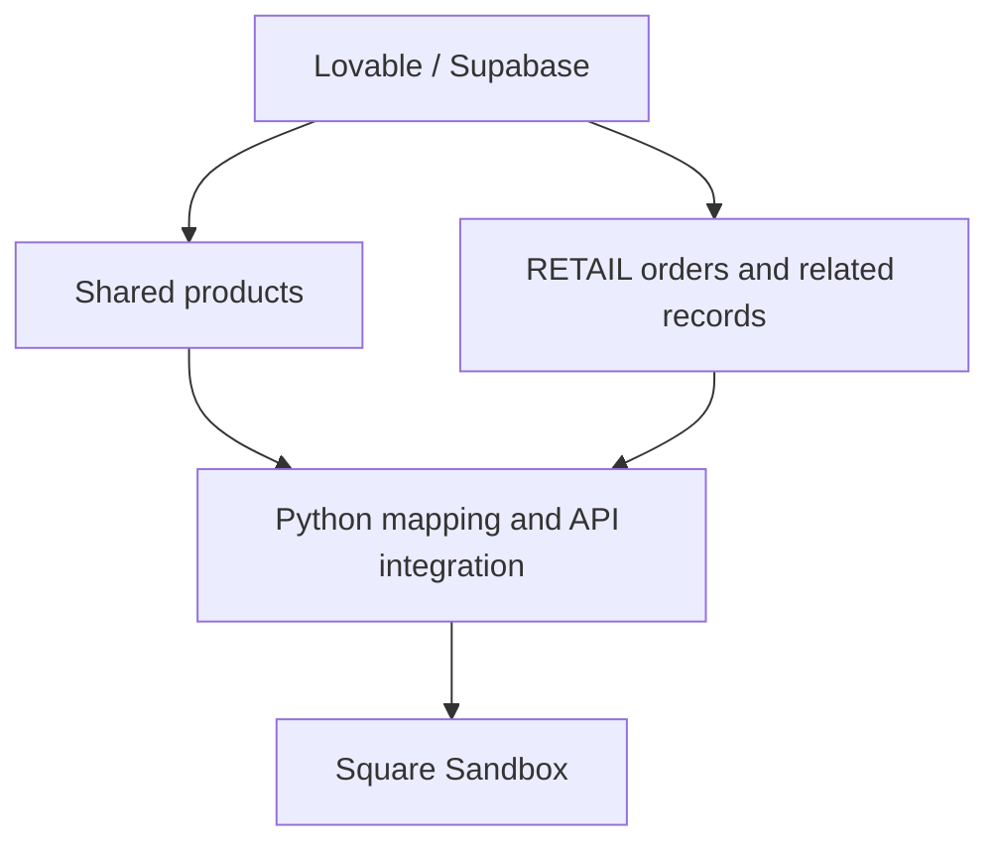
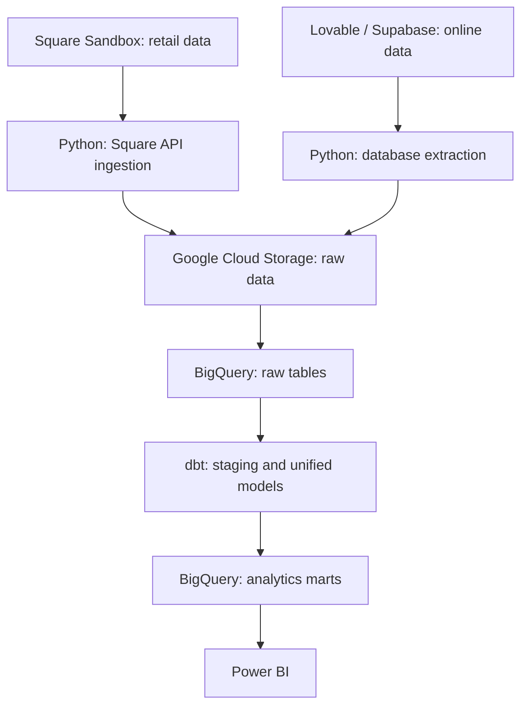
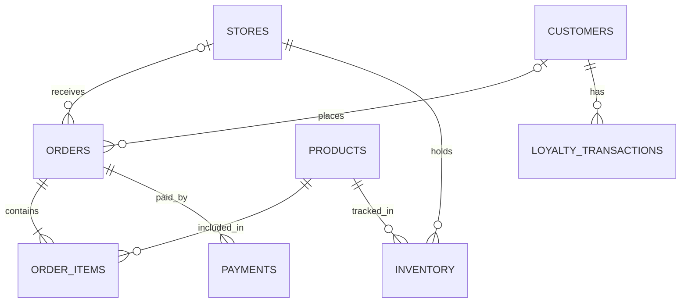

# 🍫 Charlie's Chocolate Factory — Omnichannel Retail Data Platform

> **A Data Engineering Portfolio Project for Retail & E-commerce Analytics**

An end-to-end data engineering project in progress that simulates how a retailer can combine physical-store and online sales data into a unified analytics platform.

The project uses a fictional chocolate business, Square Sandbox, and a planned GCP data pipeline to collect, transform, and analyze data across sales channels.

> **Disclaimer**
> This is an independent portfolio project using entirely synthetic data.
> It is not affiliated with Purdys Chocolatier or any other company, and does not reproduce any company's internal architecture.

---

## ✨ Project Overview

**Charlie's Chocolate Factory** is a fictional Canadian chocolate retailer with:

- 🏪 Multiple physical retail stores
- 🛒 A customer-facing online shop
- 👥 Customer accounts and rewards
- 📦 Product and inventory data
- 💳 Simulated orders and payment records

The source application was built with Lovable and stores both online and retail transactions. Orders are distinguished by their `channel`:

| Channel | Meaning | Planned Analytics Source |
|---|---|---|
| `RETAIL` | Physical-store POS transactions | Square Sandbox APIs |
| `ONLINE` | E-commerce orders | Lovable / Supabase database |

Python scripts populate Square Sandbox with shared products and retail-related test data. The analytics pipeline will then collect retail data from Square and online data directly from the source database.

### 🎯 Business Questions

- How does revenue compare between retail and online channels?
- Which physical stores perform best?
- Which products sell best across channels?
- What is the average order value by channel?
- How do identified customers shop across channels?
- How do sales vary by date and seasonal event?

Inventory monitoring and demand forecasting are future extensions.

---

## 🏗️ Architecture

### 1. Prepare the Simulated Retail Environment

The Lovable application generates synthetic data for both channels. Only retail orders and their related records are selected for Square integration.

Shared product data is also loaded into Square.



This step prepares the simulated POS environment. It is separate from the downstream analytics ingestion pipeline.

### 2. Collect and Unify Both Sales Channels — Planned



### Data Boundaries

- Load shared products into Square for retail order references.
- Send only `RETAIL` orders to Square.
- Select related order items and payment records using the selected retail order IDs.
- Keep `ONLINE` orders in the source database for direct extraction.
- Collect retail sales from Square only when building the unified sales dataset.
- Do not ingest the original Lovable retail orders as additional sales.
- Preserve source IDs and Square ID mappings for reconciliation.

---

## 🛍️ Source Systems

### Physical Stores

| Store | Internal ID |
|---|---|
| 🏙️ Downtown Vancouver | `VAN001` |
| 🌆 Burnaby | `BUR001` |
| 🌉 Richmond | `RIC001` |

Internal store IDs will be mapped to Square Location IDs.

### Core Source Entities

| Entity | Purpose |
|---|---|
| `stores` | Physical retail locations |
| `products` | Shared product master data |
| `customers` | Registered customer profiles |
| `orders` | Orders with `RETAIL` or `ONLINE` channel |
| `order_items` | Products and quantities in each order |
| `payments` | Simulated payment records |
| `inventory` | Stock records |
| `loyalty_transactions` | Customer reward activity |

Online orders can have no physical `store_id`. Guest orders can have no `customer_id`.

These entities exist in the source environment, but not all are part of the initial Square integration or warehouse scope.

---

## 🔌 Square Sandbox Integration

Square Sandbox represents the external retail POS platform.

### Integration Scope

| Source Data | Square Mapping | Status / Scope |
|---|---|---|
| Products | Catalog API | Implemented |
| Stores | Square Locations | Location mapping planned |
| Customers | Customers API | Customers needed for retail scenarios |
| `RETAIL` orders and order items | Orders API | Planned |
| Retail payment scenarios | Payments API | Sandbox workflow to be implemented |
| Inventory | Inventory API | Future extension |
| `ONLINE` orders | Not sent to Square | Extracted directly for analytics |

Payment integration will use a supported Sandbox workflow. Source payment records are synthetic and do not represent real charges.

### Product Integration — Implemented

1. Load the source product CSV into a Pandas DataFrame.
2. Check source fields and prepare product values.
3. Map source fields to the Square Catalog structure.
4. Check existing SKUs to avoid duplicate product creation.
5. Submit product payloads to Square Sandbox.
6. Save returned Square IDs for later synchronization.

### Example Product Mapping

| Source | Square Field | Example |
|---|---|---|
| Product name | `item_data.name` | Midnight Dark Chocolate Bar |
| SKU | `item_variation_data.sku` | `CCF-BAR-002` |
| Price | `price_money.amount` | `7.25` → `725` |
| Currency | `price_money.currency` | `CAD` |

### ID Mapping for Related Records

The integration will maintain mappings for:

- Source product ID / SKU → Square Item and Item Variation IDs
- Internal store ID → Square Location ID
- Source customer ID → Square Customer ID
- Source order ID → Square Order ID

Product mapping must include the Item Variation ID used to reference a product variation in retail orders.

---

## 🧩 Source Data Relationships

The diagram below describes the intended logical relationships, rather than verified database constraints.



A store or registered customer is optional on an order, allowing online and guest purchases.

---

## 🧱 Planned Warehouse Model

Retail and online data will first be staged separately, then standardized into shared sales models.

| Layer | Purpose |
|---|---|
| Raw | Preserve extracted records from each source |
| Staging | Clean types, standardize fields, and retain source identifiers |
| Intermediate | Map IDs, join order items, and align channel schemas |
| Marts | Provide sales facts, dimensions, and business metrics |

### Core Models

| Model | Grain / Purpose |
|---|---|
| `fact_sales` | One row per order item, including channel and source identifiers |
| `dim_product` | Shared product attributes |
| `dim_customer` | Mapped customer attributes where identity is available |
| `dim_store` | Physical-store attributes |
| `dim_date` | Calendar and seasonal attributes |

### Modeling Rules

- Preserve `source_system`, `channel`, source order ID, and source order-item ID.
- Use mapped product identifiers to compare products across channels.
- Represent online orders without assigning them to a physical store.
- Keep guest purchases even when no customer ID is available.
- Match customers across systems using explicit ID mappings.
- Calculate order counts and average order value at the order level.
- Keep order totals and payment records from multiplying when joined to order items.
- Define consistent treatment of discounts, taxes, shipping, refunds, and order status before comparing revenue.

Cross-channel customer analysis will be limited to purchases with a reliable customer mapping.

---

## 📊 Planned Analytics Marts

| Mart | Business Question |
|---|---|
| `mart_daily_sales` | How are sales trending over time? |
| `mart_store_sales` | Which physical stores perform best? |
| `mart_online_sales` | How is the online shop performing? |
| `mart_product_performance` | Which products sell best across channels? |
| `mart_customer_metrics` | How do identified customers purchase? |
| `mart_channel_performance` | How do retail and online sales compare? |

Inventory analytics will be added once stock ingestion and modeling are implemented.

---

## 🛠️ Tech Stack

| Layer | Technology | Status |
|---|---|---|
| Source application | Lovable / React / Supabase | In use |
| Data integration | Python / Pandas | In use |
| Retail simulation | Square Sandbox APIs | Catalog integration implemented |
| Local development | PyCharm | In use |
| Version control | Git / GitHub | In use |
| Containerization | Docker | Planned |
| Cloud storage | Google Cloud Storage | Planned |
| Data warehouse | BigQuery | Planned |
| Transformation | dbt | Planned |
| Orchestration | Kestra | Planned |
| Visualization | Power BI | Planned |

---

## 🚦 Project Status

### ✅ Completed

- Fictional multi-store retail POS application
- Customer-facing e-commerce website
- Synthetic product and transaction data
- `RETAIL` / `ONLINE` channel distinction
- Product CSV export from the source database
- Python / Pandas product processing
- Square Sandbox connection
- Product schema transformation
- Square Catalog API integration
- SKU-based duplicate detection
- Automated product loading into Square
- Initial product ID mapping persistence

### 🚧 Next: Complete Retail Test Data Integration

- Verify product mappings include Square Item Variation IDs
- Map internal stores to Square Locations
- Integrate customers needed for retail orders
- Filter source orders to `channel = 'RETAIL'`
- Select associated order items and payment records
- Create retail orders in Square Sandbox
- Implement the Sandbox payment workflow
- Extend ID mappings and verify linked records

### 🗺️ Next: Build the Analytics Pipeline

- Extract retail data through Square APIs
- Extract online data directly from Lovable / Supabase
- Collect shared product and customer reference data
- Store raw extracts in Google Cloud Storage
- Load raw tables into BigQuery
- Standardize and combine both channels with dbt
- Build dimensional models and analytics marts
- Add incremental ingestion and repeatable loads
- Validate completeness, duplicates, mappings, and sales totals
- Schedule pipeline runs with Kestra
- Build a Power BI dashboard

### 🌱 Future Enhancements

- Inventory ingestion and replenishment monitoring
- Seasonal demand analysis
- Demand forecasting
- Near real-time ingestion using Pub/Sub or Kafka

---

## 📁 Repository Structure

The Python integration follows the existing repository layout. Cloud ingestion, dbt, and orchestration components will be added as the project progresses.

```text
chocolate-commerce-data-platform/
├── data/
│   ├── raw/
│   ├── processed/
│   └── sample/
├── src/
│   ├── config/
│   ├── extract/
│   ├── transform/
│   ├── square/
│   └── pipelines/
├── README.md
├── LEARNING_NOTES.md
├── LEARNING_NOTES_en.md
├── requirements.txt
├── .env.example
└── .gitignore
```

Planned additions:

| Directory | Purpose |
|---|---|
| `src/ingestion/` | Square and online-source extraction for analytics |
| `dbt/` | Staging, intermediate models, marts, and data tests |
| `orchestration/kestra/` | Scheduled pipeline workflows |
| `dashboards/` | Power BI project assets and screenshots |
| `docs/` | Architecture, mapping rules, and metric definitions |

Local raw exports and generated payloads are excluded from version control. Shareable synthetic samples belong in `data/sample/`.

---

## 🔐 Credentials

API credentials are loaded from environment variables.

```text
SQUARE_ACCESS_TOKEN=your_sandbox_token
```

The local `.env` file is excluded through `.gitignore`. The committed `.env.example` contains placeholders only.

---

## 💡 What I Am Learning

This project is being developed alongside my Data Engineering studies. Each stage applies a new concept to the same retail scenario.

| Topic | Application |
|---|---|
| Python / Pandas | Read, validate, and transform source data |
| API integration | Populate and extract data from Square Sandbox |
| GCP | Store raw data and operate a cloud warehouse |
| dbt | Standardize sources and build analytical models |
| Data quality | Reconcile records and prevent duplicate sales |
| Kestra | Schedule and monitor pipeline runs |
| Power BI | Compare retail and online business performance |

Implementation decisions and learning progress are documented in `LEARNING_NOTES.md` and `LEARNING_NOTES_en.md`.

---

## 🎯 Project Goal

Build a reproducible pipeline that collects retail data from Square and online data from the e-commerce database, then combines them into consistent, traceable datasets for omnichannel analytics.

**API & Database Ingestion → Cloud Storage → Data Warehouse → Transformation → Analytics**

### 🍫 Built with data, APIs, cloud tools — and a little chocolate.