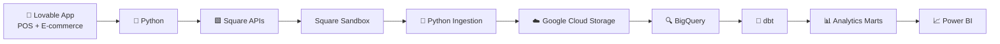
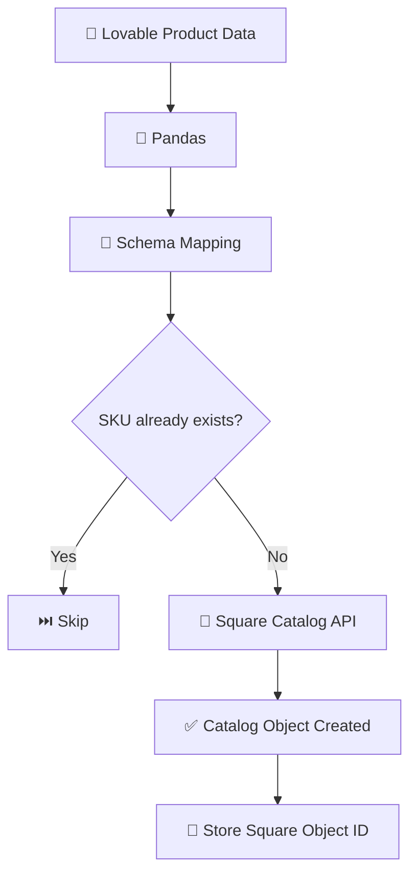
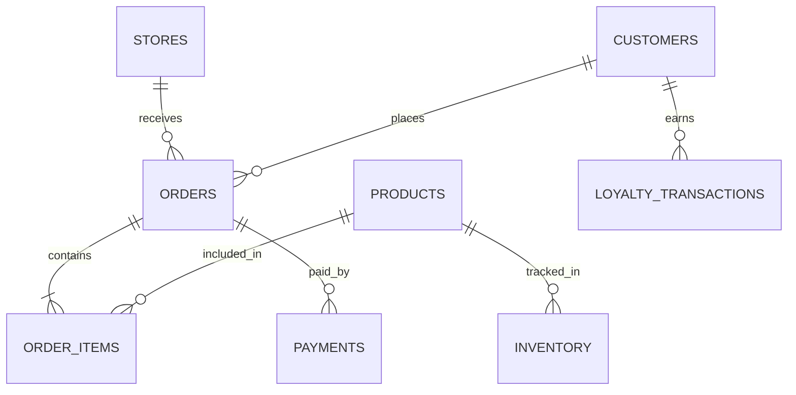
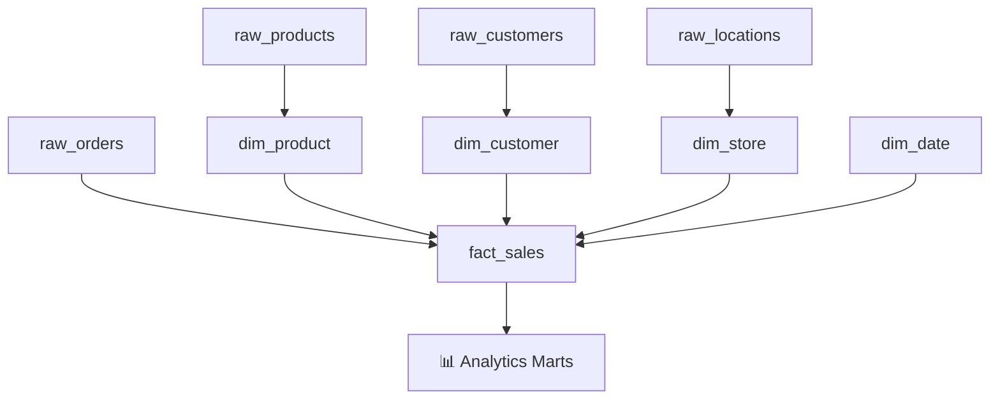

# 🍫 Charlie's Chocolate Factory — Omnichannel Retail Data Platform

> **A Data Engineering Platform for Retail, E-commerce & Inventory Analytics**

An end-to-end data engineering portfolio project that simulates how an omnichannel retailer can integrate data from physical stores and an online shop, ingest operational data through APIs, and transform it into analytics-ready datasets.

The project combines a fictional multi-store chocolate retailer with a modern data engineering pipeline.

> ⚠️ **Disclaimer**  
> This is an independent portfolio project inspired by the business model of an omnichannel specialty retailer.  
> It is not affiliated with Purdys Chocolatier or any other company and uses entirely synthetic data.

---

## ✨ Project Overview

**Charlie's Chocolate Factory** is a fictional Canadian chocolate retailer operating:

🏪 Physical retail stores  
🛒 An online e-commerce store  
👥 Customer accounts & rewards  
📦 Product and inventory systems  
💳 POS and payment transactions  

The goal of this project is to bring these separate operational data sources together into a unified analytics platform.

### 🎯 Business Problem

Retail businesses often generate data across multiple systems:

| Source | Example Data |
|---|---|
| 🏪 Retail POS | Store transactions, products, payments |
| 🛒 E-commerce | Online orders, guest/member purchases |
| 👤 Customers | Profiles, loyalty activity |
| 📦 Inventory | Product availability and stock |
| 💳 Payments | Transaction and payment details |

Without a unified data platform, it is difficult to answer questions such as:

- Which sales channel generates the most revenue?
- Which stores perform best?
- What are the best-selling products?
- How do online and retail customers behave differently?
- What is the average order value?
- How do seasonal events affect sales?
- Which products may need inventory replenishment?

---

# 🏗️ Architecture



### Data Flow

```text
Operational Systems
        ↓
API Integration
        ↓
Raw Data Ingestion
        ↓
Cloud Storage
        ↓
Data Warehouse
        ↓
Data Transformation
        ↓
Analytics Models
        ↓
Business Intelligence
```

---

# 🛍️ Source Systems

The operational environment was built as a fictional omnichannel retail business.

### Retail Stores

| Store | Internal ID |
|---|---|
| 🏙️ Downtown Vancouver | `VAN001` |
| 🌆 Burnaby | `BUR001` |
| 🌉 Richmond | `RIC001` |

### Sales Channels

| Channel | Description |
|---|---|
| `RETAIL` | Physical store POS transactions |
| `ONLINE` | Customer-facing e-commerce orders |

The source application stores products, customers, orders, payments, inventory and loyalty activity.

---

# 🔌 Square API Integration

Square Sandbox is used to simulate integration with an external retail platform.

Instead of manually recreating operational data, Python scripts transform the source data into Square-compatible API payloads.

### Integration Flow



### Current API Mapping

| Source Data | Square |
|---|---|
| Products | Catalog API |
| Stores | Locations API |
| Customers | Customers API |
| Orders | Orders API |
| Payments | Payments API |
| Inventory | Inventory API |

---

# 🔄 Example: Product Data Mapping

Source product data:

```text
product_id: P002
sku: CCF-BAR-002
product_name: Midnight Dark Chocolate Bar
price: 7.25
```

is transformed into the Square Catalog structure:

```text
product_name → item_data.name

sku
→ item_variation_data.sku

price: 7.25
→ price_money.amount: 725

currency
→ CAD
```

The Python integration also checks existing Square SKUs before creating new products to prevent duplicate catalog records.

---

# 🧩 Data Model

The source system currently includes data such as:



### Core Entities

| Entity | Purpose |
|---|---|
| `stores` | Physical retail locations |
| `products` | Product master data |
| `customers` | Registered customers |
| `orders` | Retail and online transactions |
| `order_items` | Products contained in each order |
| `payments` | Payment records |
| `inventory` | Store-level stock |
| `loyalty_transactions` | Customer reward history |

---

# 🧱 Planned Warehouse Model

After ingestion into BigQuery, raw operational data will be transformed into an analytics-friendly dimensional model.



Planned models include:

| Model | Purpose |
|---|---|
| `fact_sales` | Transaction-level sales facts |
| `dim_product` | Product attributes |
| `dim_customer` | Customer attributes |
| `dim_store` | Retail store information |
| `dim_date` | Date and seasonal dimensions |

---

# 📊 Planned Analytics Marts

The final warehouse will support datasets such as:

| Mart | Business Question |
|---|---|
| `mart_daily_sales` | How are sales trending over time? |
| `mart_store_sales` | Which stores perform best? |
| `mart_online_sales` | How is e-commerce performing? |
| `mart_product_performance` | Which products sell best? |
| `mart_customer_metrics` | How do customers behave? |
| `mart_inventory_status` | Which products may require restocking? |
| `mart_channel_performance` | Retail vs Online performance |

---

# 🛠️ Tech Stack

| Layer | Technology |
|---|---|
| 🎨 Source Application | Lovable / React / Supabase |
| 🐍 Data Integration | Python / Pandas |
| 🔌 External Retail API | Square APIs |
| 🐳 Development Environment | Docker |
| ☁️ Cloud Platform | Google Cloud Platform |
| 🪣 Data Lake | Google Cloud Storage |
| 🏢 Data Warehouse | BigQuery |
| 🔧 Transformation | dbt |
| ⚙️ Orchestration | Kestra |
| 📊 Visualization | Power BI |
| 🔀 Version Control | Git / GitHub |

---

# 🚦 Project Status

### ✅ Completed

- Fictional multi-store retail POS system
- Customer-facing e-commerce website
- Synthetic product and transaction data
- Product CSV extraction from source database
- Python / Pandas source-data processing
- Square Sandbox connection
- Square Catalog API integration
- SKU-based duplicate detection
- Product schema transformation
- Automated product loading into Square

### 🚧 In Progress

- Store / location mapping
- Order integration
- Payment integration
- Customer integration
- Source-to-Square ID mapping

### 🗺️ Next

- Square API data extraction
- Google Cloud Storage raw layer
- BigQuery warehouse
- Incremental ingestion
- dbt transformations
- Dimensional data modeling
- Analytics marts
- Kestra orchestration
- Data quality checks
- Power BI dashboard

### 🌱 Future Enhancements

- Pub/Sub or Kafka streaming
- Near real-time transaction ingestion
- Inventory monitoring
- Seasonal demand analysis
- Demand forecasting

---

# 📁 Planned Repository Structure

```text
charlies-retail-data-platform/
│
├── data/
│   └── sample/
│
├── src/
│   ├── ingestion/
│   ├── square/
│   ├── transformation/
│   └── utils/
│
├── dbt/
│   ├── models/
│   │   ├── staging/
│   │   ├── intermediate/
│   │   └── marts/
│   └── tests/
│
├── orchestration/
│   └── kestra/
│
├── terraform/
│
├── dashboards/
│
├── docs/
│
├── .env.example
├── .gitignore
├── requirements.txt
└── README.md
```

---

# 🔐 Security

API credentials and secrets are never committed to the repository.

Local credentials are stored using environment variables:

```text
SQUARE_ACCESS_TOKEN=your_sandbox_token
```

The real `.env` file is excluded through `.gitignore`.

---

# 💡 What I Am Learning

This project is being developed alongside my Data Engineering studies.

Rather than completing the entire curriculum first, each new concept is applied directly to the project.

```text
Learn → Build → Test → Improve
```

Examples:

🐍 API ingestion → Square integration  
☁️ GCP → Raw data storage  
🔍 BigQuery → Data warehouse  
🔧 dbt → Analytics modeling  
⚙️ Kestra → Pipeline orchestration  
📊 Power BI → Business analytics  

---

# 🎯 Project Goal

The final goal is to build a reproducible end-to-end retail data platform that demonstrates:

**API Integration → Data Ingestion → Cloud Storage → Data Warehousing → Transformation → Orchestration → Analytics**

while solving realistic omnichannel retail data problems.

---

### 🍫 Built with data, APIs, cloud tools — and a little chocolate.
