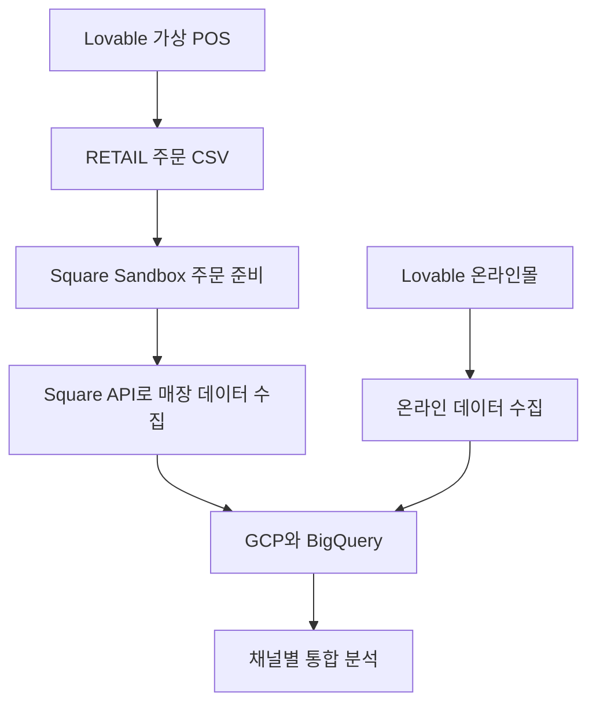
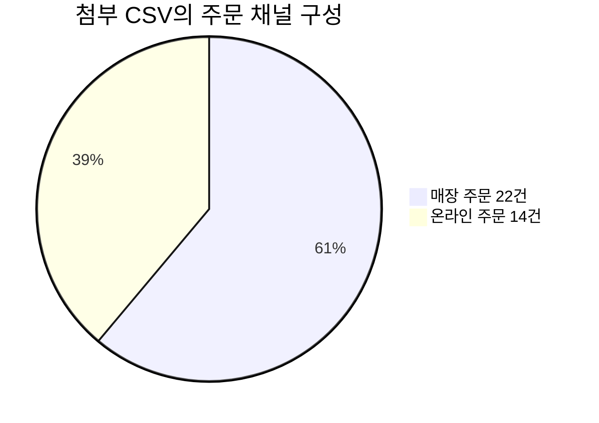
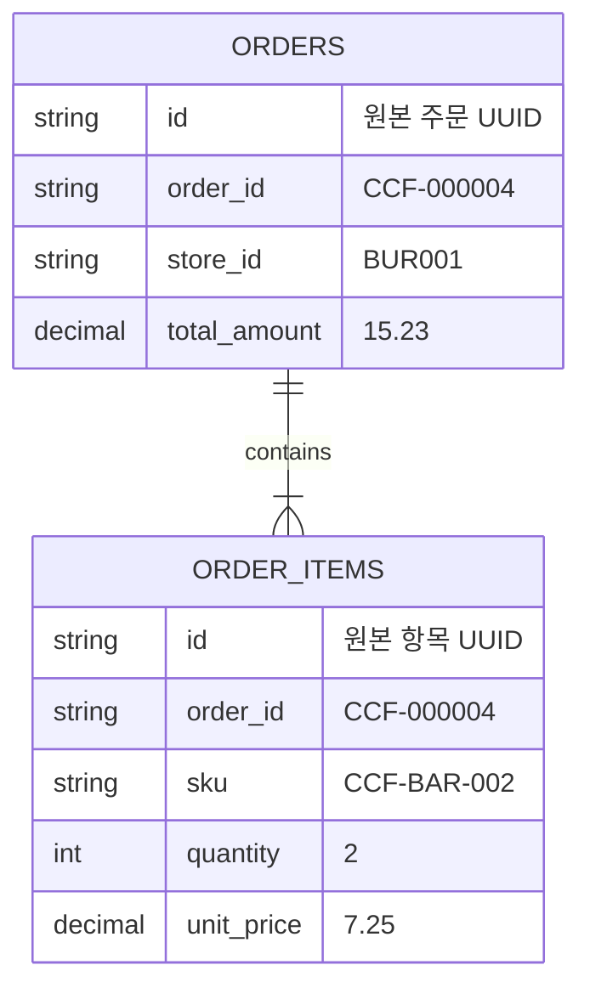
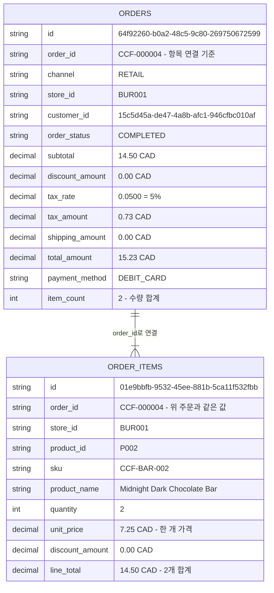
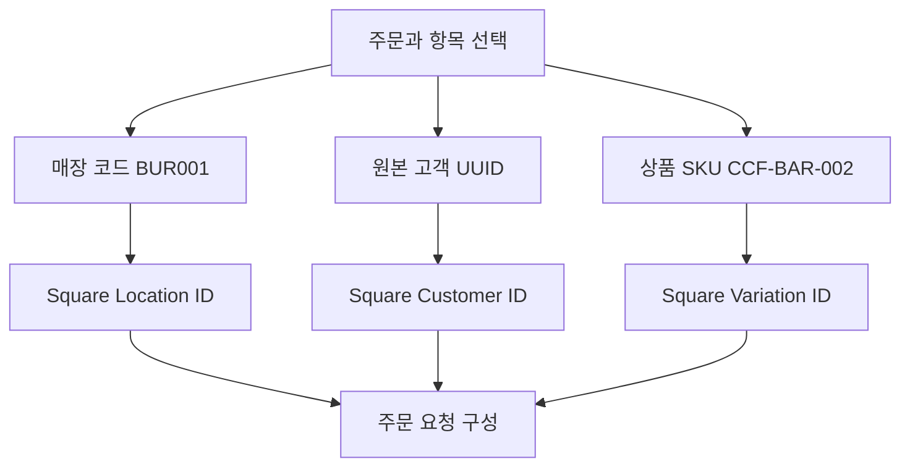
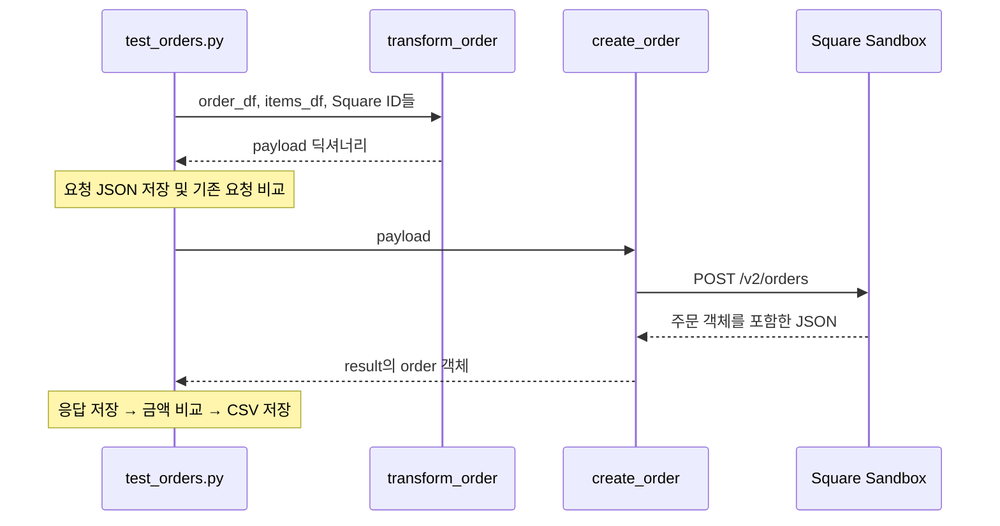
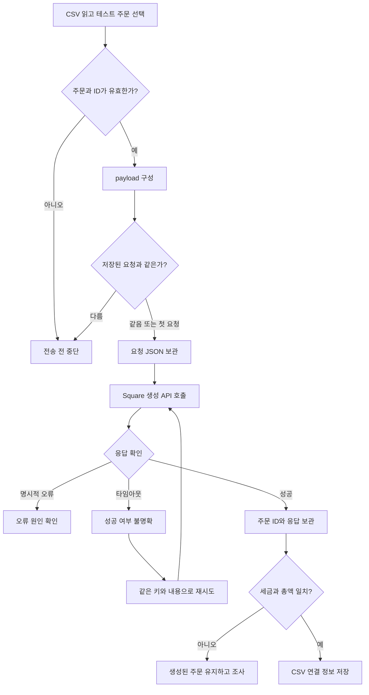
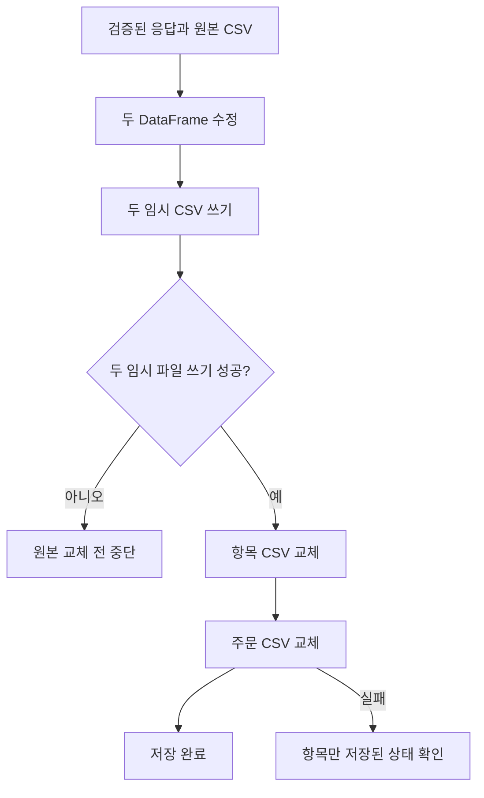

# 🛒 주문 연동 학습 노트

> 예시 주문: `CCF-000004` · Lovable CSV → Square Sandbox  
> 이 문서는 대화에서 작성한 코드의 동작을 설명한다. 실제 주문 생성 성공 여부는 아직 확인하지 않았다.

## 1. 먼저 이해할 것: 주문은 여러 데이터를 묶는 작업이다

상품 등록은 상품 한 건의 이름·가격을 변환하는 작업이었다.
주문은 **어느 매장에서, 누가, 어떤 상품을, 몇 개, 얼마에 샀는지**를 함께 전달한다.
그래서 주문 CSV만 읽어서는 부족하고, 주문 항목과 기존 Square ID도 필요하다.

| 질문 | 필요한 데이터 | 예시 |
|---|---|---|
| 어떤 주문인가? | 주문 번호 | CCF-000004 |
| 어디서 샀나? | 매장 → Square Location ID | BUR001 |
| 누가 샀나? | 고객 → Square Customer ID | 원본 고객 UUID |
| 무엇을 샀나? | 주문 항목 → Square Variation ID | CCF-BAR-002 |
| 몇 개 샀나? | quantity | 2 |
| 얼마인가? | 주문 당시 단가·세금 | $7.25 × 2 + 원본 세금 $0.73 |

**지금 목표:** 이 정보를 하나의 요청으로 묶어 Square에 주문을 만들고, 반환된 ID를 CSV에 기록한다.

## 2. 전체 프로젝트에서 지금 위치

실제 Purdys 내부 구조를 재현했다고 주장하는 프로젝트가 아니다. 매장과 온라인이라는 두 주문 경로를 가정한 개인 프로젝트다.



- **지금:** 가상 매장 데이터를 Square에 넣는다.
- **이후:** Square와 Lovable에서 각각 데이터를 꺼내 통합한다.
- 온라인 주문은 이번 Square 전송 대상에 포함하지 않는다.
- 통합할 때 Lovable의 RETAIL 주문까지 다시 합치면 매장 거래가 중복된다.

## 3. 첨부 CSV에서 확인한 범위

| 구분 | 주문 수 | 주문 항목 행 수 |
|---|---:|---:|
| RETAIL | 22 | 55 |
| ONLINE | 14 | 37 |
| 전체 | 36 | 92 |

매장 주문 22건은 완료 19건, 취소 1건, 환불 2건이다.
현재 변환 함수는 완료 주문 중 할인·배송비가 없는 주문만 처리한다.
취소·환불은 이후 별도 흐름으로 구현한다.



첨부 파일에서는 주문·항목 연결 누락과 ID 중복이 없었고, 항목 계산 및 주문 합계도 내부적으로 일치했다.
이 결과는 **원본 CSV 검증**이며 Square 계산 결과 검증은 아니다.

## 4. orders와 order_items는 왜 나뉘어 있을까?

`orders` 한 행은 주문 전체를 나타낸다.
`order_items` 한 행은 그 주문에 들어 있는 상품 항목 하나를 나타낸다.
한 주문에 상품 종류가 여러 개라면 주문 항목 행도 여러 개다.



이 그림은 이번 CSV에서 확인한 논리적 관계다. DB의 실제 외래 키 제약을 확인한 것은 아니다.

### 이번 파일의 정확한 연결 키

```python
order_items_df["order_id"] == order_df["order_id"].iloc[0]
```

**`order_items.order_id`는 `orders.id`가 아니라 `orders.order_id`와 연결된다.**

| 값 | 의미 |
|---|---|
| orders.id | 원본 주문의 UUID |
| orders.order_id | CCF-000004 같은 주문 번호 |
| order_items.id | 개별 주문 항목의 UUID |
| order_items.order_id | 항목이 속한 주문 번호 |
| orders.square_order_id | Square가 생성 후 반환하는 주문 ID |

## 5. 컬럼과 값을 ERD로 읽기 — CCF-000004

각 상자의 한 줄은 **자료형 · 컬럼명 · 예시 값** 순서다.
`ORDERS`는 `order_df`의 한 행, `ORDER_ITEMS`는 `items_df`의 상품 항목을 나타낸다.
두 상자의 `order_id` 값이 **CCF-000004**로 같아서 연결된다.



### 그림 읽는 순서

1. **주문 찾기:** ORDERS의 `order_id = CCF-000004`를 찾는다.
2. **항목 연결:** ORDER_ITEMS에서 같은 `order_id`를 가진 행을 찾는다.
3. **상품 계산:** `quantity 2 × unit_price 7.25 = line_total 14.50`이다.
4. **주문 계산:** 이번 주문은 항목 하나이므로 `subtotal = 14.50`이다. 여기에 원본 세금 `0.73`을 더하면 `total_amount = 15.23`이다.

관계선의 `||`는 주문 한 건, `|{`는 한 개 이상의 주문 항목을 뜻한다.
이번 예시는 항목 한 행이지만, 다른 주문에는 여러 항목이 연결될 수 있다.

**상품 두 개를 샀지만, 같은 상품이므로 항목은 한 행이다.**
이번 데이터의 `item_count`는 항목 행 수가 아니라 `quantity`의 합계다.

> 자료형은 이해를 돕기 위한 논리적 표시다. CSV나 실제 DB의 자료형·PK·FK 제약을 선언한 것이 아니다.
> 오른쪽의 CAD와 설명 문구는 주석이며 CSV 값 자체에 포함되지 않는다.
> 읽기 쉽도록 주요 컬럼만 표시했다. 원본은 주문 35개 컬럼, 주문 항목 14개 컬럼이다.

## 6. 코드에서 DataFrame이 바뀌는 순서

| 변수 | 내용 | 이번 예시 크기 |
|---|---|---|
| orders_df | 모든 주문 | 36행 |
| retail_orders_df | RETAIL 주문만 | 22행 |
| order_df | CCF-000004 한 건 | 1행 |
| order | order_df에서 꺼낸 한 행, Series | 주문 한 건 |
| order_items_df | 모든 주문 항목 | 92행 |
| items_df | CCF-000004에 속한 항목 | 1행 |

```python
# 1. 매장 주문만 남긴다.
retail_orders_df = orders_df.loc[
    orders_df["channel"] == "RETAIL"
].copy()

# 2. 원하는 주문 번호를 고른다.
target_order_id = "CCF-000004"
order_df = retail_orders_df.loc[
    retail_orders_df["order_id"] == target_order_id
].copy()

# 3. 이 주문의 항목만 가져온다.
items_df = order_items_df.loc[
    order_items_df["order_id"] == target_order_id
].copy()

# 4. 변환 함수 내부에서 주문 한 행의 값을 읽는다.
order = order_df.iloc[0]
```

- `.loc[조건]`: 조건에 맞는 행 선택.
- `.copy()`: 선택 결과를 별도 DataFrame으로 사용.
- `.iloc[0]`: 첫 행을 Series로 꺼내기.
- `order["store_id"]`: 선택한 한 행의 매장 값 읽기.
- `.iterrows()`: 주문 항목을 한 행씩 순회. 지금은 한 행이지만 여러 상품도 처리할 수 있다.

## 7. 원본 ID를 그대로 Square에 넣으면 안 되는 이유

`BUR001`은 내 시스템에서 사용하는 매장 코드다.
Square는 자신이 발급한 Location ID로 매장을 찾는다.
고객과 상품도 같은 방식으로 변환해야 한다.



| 연결 기준 | 찾아야 할 값 | 요청에 들어가는 위치 |
|---|---|---|
| store_id | Square Location ID | order.location_id |
| customer_id | Square Customer ID | order.customer_id |
| sku | Square Item Variation ID | order.line_items[].catalog_object_id |

현재 제안한 테스트 코드는 이 세 ID를 직접 입력받는다.
**최신 상품·고객·매장 CSV에서 자동 조회하는 기능은 아직 붙이지 않았다.**

```python
variation_ids_by_sku = {
    "CCF-BAR-002": "실제 Square Variation ID"
}
```

이 딕셔너리는 SKU를 키로 사용해 Square 상품 판매 단위 ID를 찾는 작은 매핑표다.
상품 Item ID와 Variation ID는 다르므로 반드시 Variation ID를 넣는다. [2]

## 8. 파일 세 개의 역할

| 파일 | 담당하는 일 | 외부 API 호출 |
|---|---|---|
| tests/test_orders.py | 읽기·선택·ID 전달·함수 실행·검증·파일 저장 | create_order()를 호출 |
| src/transform/orders.py | 원본 데이터 검증과 요청 딕셔너리 생성 | 없음 |
| src/square/orders.py | HTTP 요청 전송과 API 응답 확인 | 있음 |

현재 `tests/test_orders.py`는 직접 실행하는 수동 통합 테스트 스크립트다.
파일명이 test여도 자동 단위 테스트로 구현한 것은 아니다.



**변환 함수가 성공해도 아직 주문은 생성되지 않았다.**
실제로 Square에 쓰는 시점은 `requests.post()` 실행 시점이다.

## 9. payload를 작은 상자로 나누어 이해하기

`payload`는 API에 전달할 요청 내용이다. Python에서는 딕셔너리로 만들고,
`requests.post(..., json=payload)`가 JSON으로 직렬화해 전송한다.

아래는 구조 설명용 예시다. `<...>`는 실제 ID로 교체해야 한다.

```json
{
  "idempotency_key": "ccf-sandbox-order-CCF-000004-v1",
  "order": {
    "reference_id": "CCF-000004",
    "location_id": "<Square Location ID>",
    "customer_id": "<Square Customer ID>",
    "state": "OPEN",
    "line_items": [
      {
        "uid": "01e9bbfb-9532-45ee-881b-5ca11f532fbb",
        "catalog_object_id": "<Square Variation ID>",
        "quantity": "2",
        "base_price_money": {
          "amount": 725,
          "currency": "CAD"
        }
      }
    ],
    "pricing_options": {
      "auto_apply_taxes": false,
      "auto_apply_discounts": false
    },
    "taxes": [
      {
        "uid": "source-order-tax",
        "name": "Sales Tax",
        "type": "ADDITIVE",
        "scope": "ORDER",
        "percentage": "5"
      }
    ]
  }
}
```

| 필드 | 쉽게 설명하면 |
|---|---|
| idempotency_key | 같은 생성 요청을 재시도할 때 사용하는 식별표 |
| reference_id | 내 원본 주문 번호를 Square에 함께 보관 |
| location_id | 주문이 발생한 Square 매장 |
| customer_id | 주문한 Square 고객 |
| line_items | 주문에 들어간 상품 항목 목록 |
| line_items[].uid | 주문 안에서 항목을 식별하는 값. 이번 코드는 원본 항목 UUID 사용 |
| catalog_object_id | 주문 상품의 Square Variation ID |
| base_price_money | 상품 한 개의 주문 당시 가격 |
| taxes | 세금 계산에 사용할 규칙 |

`auto_apply_taxes: false`는 카탈로그 세금의 자동 적용을 끄는 설정이다.
위에서 직접 지정한 `taxes`까지 없앤다는 뜻은 아니다.

### 왜 총액 15.23을 직접 넣지 않을까?

이번 요청에서는 단가·수량·세금 규칙을 보내고 Square가 계산한 합계를 응답으로 받는다.
원본 `total_amount`는 그 결과가 맞는지 비교하는 기준으로 사용한다.

### 왜 payment_method를 넣지 않을까?

원본의 `DEBIT_CARD`는 원본 결제 방식 기록이다.
그 문자열만 보내서 Square 결제가 실행되는 것은 아니다. 결제 연동은 별도 단계다. [3]

## 10. 금액 계산: 단위부터 맞추기

| 값 | 원본 | Square 요청 또는 비교값 |
|---|---:|---:|
| 단가 | 7.25 CAD | 725센트 |
| 수량 | 2 | 문자열 "2" |
| 상품 소계 | 14.50 CAD | 1450센트 |
| 세율 | 0.0500 | 문자열 "5" |
| 원본 세금 | 0.73 CAD | 비교 기준 73센트 |
| 원본 총액 | 15.23 CAD | 비교 기준 1523센트 |

```python
# 개념 예시
subtotal_cents = 725 * 2       # 1450
expected_tax_cents = 73       # CSV에 저장된 세금
expected_total_cents = 1523   # CSV에 저장된 총액
```

**단가 725를 보내야 한다. 소계 1450을 단가로 보내면 수량 2가 다시 곱해진다.**

원본의 세전 금액 × 5%는 `$0.725`다.
원본에는 `$0.73`이 저장되어 있지만, Square 응답이 반드시 같다고 가정하지 않는다.
반올림과 항목별 세금 배분 방식에 따라 차이가 날 수 있으므로 실제 응답을 비교해야 한다.

`Decimal(str(value))`는 금액 변환에서 이진 부동소수점 오차를 줄이기 위해 사용한다.
현재 `to_cents()`는 센트보다 작은 단위가 있으면 임의로 반올림하지 않고 오류를 낸다.

## 11. 전체 실행 알고리즘



의사코드로 읽으면 다음과 같다.

```text
주문 CSV와 항목 CSV를 읽는다.
RETAIL 주문 중 CCF-000004를 선택한다.
그 주문에 속한 항목만 가져온다.

주문 1건, 항목 존재, 원본 상태, 할인·배송비를 확인한다.
매장·고객·상품 Square ID를 확인한다.
항목 금액과 원본 합계를 확인한다.

Square 요청 딕셔너리를 만든다.
같은 테스트 키의 기존 요청과 내용이 다르면 중단한다.
요청을 파일에 보관한다.

API를 호출한다.
성공하면 응답의 order 객체와 ID를 보관한다.
Square 계산 금액을 원본과 비교한다.

금액이 다르면: 생성은 성공했으므로 재생성하지 않고 원인을 확인한다.
금액이 같으면: 원본 CSV의 Square 연결 컬럼을 갱신한다.
```

## 12. API 응답에서 꺼내는 값

전체 HTTP 응답 본문은 다음처럼 `order`로 감싸져 있다. 아래 금액은 설명용 예시이며 실제 응답이 아니다.

```json
{
  "order": {
    "id": "<생성된 Square Order ID>",
    "reference_id": "CCF-000004",
    "state": "OPEN",
    "location_id": "<Square Location ID>",
    "total_tax_money": { "amount": 73, "currency": "CAD" },
    "total_money": { "amount": 1523, "currency": "CAD" }
  }
}
```

현재 `create_order()`는 전체 응답이 아니라 내부 `order` 객체만 반환한다.

```python
# src/square/orders.py 내부
result = response.json()
return result["order"]

# tests/test_orders.py 내부
square_order = create_order(payload)
square_order_id = square_order["id"]
```

따라서 테스트 코드에서 `square_order["order"]["id"]`로 다시 접근하지 않는다.

## 13. CSV에는 무엇을 저장할까?

### orders_export.csv

| 컬럼 | 저장 값 |
|---|---|
| square_order_id | square_order["id"] |
| square_customer_id | 응답의 customer_id |
| square_location_id | 응답의 location_id |
| square_sync_status | 생성·금액 검증·저장 성공 후 SUCCESS |
| square_synced_at | UTC 저장 시각 |
| square_sync_error | 성공 시 빈 값 |

### order_items_export.csv

| 컬럼 | 저장 값 |
|---|---|
| square_line_item_uid | 응답 항목의 uid |
| square_catalog_object_id | 응답 항목의 Variation ID |

항목 연결은 응답의 순서를 믿기보다 요청에 지정한 `uid`로 맞춘다.
같은 상품이 여러 항목에 등장해도 원본 항목 UUID는 각 항목을 구분할 수 있다.

```python
square_items_by_uid = {
    item["uid"]: item
    for item in square_order["line_items"]
}
```

### 임시 파일을 사용하는 이유

원본에 바로 쓰다가 중단되면 원본 파일이 일부만 남을 수 있다.
그래서 `.csv.tmp`에 먼저 쓰고, 쓰기가 끝나면 원본 경로로 교체한다.



**각 파일 교체와 두 파일을 함께 저장하는 것은 다르다.**
항목 CSV 교체 후 주문 CSV 교체가 실패하면 부분 성공 상태가 된다.
이때 Square 주문은 유지하고 같은 응답으로 CSV 저장을 재시도한다.
로컬 CSV 수정은 Lovable DB에 자동 반영되지 않는다.

## 14. 세 가지 상태를 구분하기

| 상태 | 어디에 있는가? | 의미 |
|---|---|---|
| 원본 order_status = COMPLETED | Lovable에서 export한 CSV | 원본 시스템의 거래 상태 |
| Square state = OPEN | 새로 생성한 Square 주문 | 이번 테스트에서 생성한 주문 상태 |
| square_sync_status = SUCCESS | 로컬 CSV | 이 단계의 연동·검증·저장 성공 |

**원본 주문 완료 ≠ 새 Square 주문 결제 완료 ≠ CSV 연동 성공.**
이번 코드는 원본 `order_status`를 변경하지 않는다.
Square 결제 완료는 다음 결제 단계에서 확인한다.

원본 `created_at`과 Square의 생성 시각도 다르다.
과거 주문을 오늘 재현하면 Square 생성 시각은 원본 거래 시각과 같지 않다.
향후 날짜별 매출 분석에는 원본 거래 시각을 매핑으로 보존해 사용하는 설계가 필요하다.

## 15. 재실행과 오류를 이해하기

### idempotency_key와 reference_id는 다르다

| 값 | 목적 |
|---|---|
| reference_id = CCF-000004 | 외부 시스템의 원본 주문 식별 |
| idempotency_key = ccf-sandbox-order-CCF-000004-v1 | 같은 생성 요청의 재시도 식별 |

`reference_id`만 같다고 중복 생성이 자동 차단된다고 생각하면 안 된다.
현재 테스트는 고정 키와 보관한 요청 내용 비교를 사용한다. [1]

| 발생 상황 | 다음 행동 |
|---|---|
| Square ID가 비어 있음 | 올바른 매장·고객·Variation ID 확인 |
| HTTP 오류 응답 | 응답의 오류 내용을 읽고 원인 수정 |
| 타임아웃 | 생성됐을 수도 있으므로 같은 키·같은 내용으로 재시도 |
| 기존 요청 JSON과 새 payload가 다름 | 원래 주문 생성 여부부터 확인 |
| 생성 성공 후 금액 불일치 | 주문 ID를 유지하고 세금·가격·반올림 확인 |
| CSV 저장 실패 | 생성된 주문 유지, 응답으로 저장만 재시도 |
| Dashboard에서 주문이 안 보임 | API 응답과 주문 조회로 확인; 화면 노출에는 별도 조건이 있음 |

Orders API에는 주문 삭제 엔드포인트가 없다. 상품 생성 때의 삭제 rollback을 그대로 적용하지 않는다. [2]

현재 요청 JSON은 `data/processed/CCF-000004_request.json`, 응답은 `CCF-000004_response.json`에 저장한다.
응답 저장 자체가 실패해도 이미 API 생성은 완료됐을 수 있다. 출력된 주문 ID와 같은 키의 요청을 이용해 복구한다.

현재 코드는 운영용 중복 방지 전체를 구현한 상태는 아니다.
일괄 처리로 확장할 때 기존 `square_order_id` 확인·조회·복구 흐름을 추가한다.

## 16. 이해하면서 실행하는 순서

- [ ] `order_df`에 CCF-000004 한 행이 있는지 확인한다.
- [ ] `items_df`에 SKU CCF-BAR-002, 수량 2가 있는지 확인한다.
- [ ] BUR001에 해당하는 Square Location ID를 준비한다.
- [ ] 원본 고객 UUID에 해당하는 Square Customer ID를 준비한다.
- [ ] SKU에 해당하는 Square Variation ID를 준비한다.
- [ ] `transform_order()`만 실행하고 payload를 읽는다.
- [ ] amount가 725, quantity가 "2", percentage가 "5"인지 확인한다.
- [ ] `create_order()`를 실행하고 Square Order ID를 확인한다.
- [ ] 실제 세금·총액 응답을 CSV와 비교한다.
- [ ] 검증 성공 시 주문·항목 CSV에 연결 정보를 저장한다.
- [ ] 결제는 다음 단계에서 진행한다.

## 17. 지금 코드가 하는 일과 이후 할 일

| 구분 | 범위 |
|---|---|
| 작성한 코드 | RETAIL 주문 선택, 단일 주문 변환, API 호출, 응답 보관, 금액 비교, CSV 저장 |
| 아직 실행 확인 필요 | 실제 Square 주문 생성 성공, 실제 계산 금액, CSV 저장 결과 |
| 다음 연결 작업 | 최신 매장·고객·상품 CSV에서 Square ID 자동 조회 |
| 이후 확장 | 결제, 취소·환불, 할인, 일괄 처리, 재실행 복구 |
| 분석 단계 | 두 소스 수집, 원본 거래 시각 보존, 통합 모델링, 자동화 |

### 내가 설명할 수 있어야 하는 네 문장

1. 주문 CSV는 거래 전체, 주문 항목 CSV는 거래에 들어간 상품들을 담는다.
2. 원본의 매장·고객·상품 식별자를 Square 식별자로 연결한다.
3. 주문과 항목을 하나의 JSON 요청으로 보내고 Square 계산 금액을 검증한다.
4. 응답 ID를 원본과 연결해 저장하고, 결제 처리는 별도로 진행한다.

## 📚 참고 자료

원본 자료: 이 대화에 첨부한 `orders_export.csv`, `order_items_export.csv` 및 함께 작성한 코드.

1. [Square CreateOrder API](https://developer.squareup.com/reference/square/orders-api/create-order) — 요청·응답 및 멱등성 키.
2. [Square Create Orders](https://developer.squareup.com/docs/orders-api/create-orders) — Variation 연결, 주문 상태, 화면 표시 조건 및 삭제 제한.
3. [Square Pay for Orders](https://developer.squareup.com/docs/orders-api/pay-for-orders) — 주문 결제 처리.
4. [Square OrderLineItem](https://developer.squareup.com/reference/square/objects/OrderLineItem) — 주문 항목 필드.
5. [Square OrderLineItemTax](https://developer.squareup.com/reference/square/objects/OrderLineItemTax) — 세금 규칙 필드.

문서의 코드 조각은 흐름을 설명하기 위한 발췌이며, 전체 실행 소스는 아니다.
Mermaid 코드 블록은 지원되는 Markdown 미리보기에서 그림으로 표시된다. 표와 설명만으로도 흐름을 따라갈 수 있도록 구성했다.
