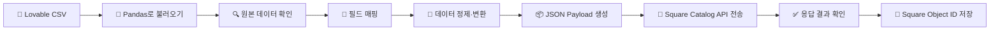

# Entity Mapping

## Lovable → Square

| Lovable Entity | Square Resource | Status |
|---|---|---|
| products | Catalog | 🟡 In Progress |
| customers | Customers | ⚪ Not Started |
| customer_addresses | Customers | ⚪ Not Started |
| stores | Locations | ⚪ Not Started |
| orders | Orders | ⚪ Not Started |
| order_items | Order Line Items | ⚪ Not Started |
| payments | Payments | ⚪ Not Started |
| loyalty_settings | Loyalty | ⚪ Not Started |
| loyalty_transactions | Loyalty | ⚪ Not Started |
| tax_settings | Catalog Tax | ⚪ Not Started |


## 🔄 Lovable 상품 데이터를 Square로 연동하는 과정

Lovable 데이터베이스에서 상품 데이터를 CSV 파일로 내보낸 뒤, Square Catalog API를 통해 Square에 등록했다.

단순히 CSV 파일을 Square로 보내는 것은 아니다. Lovable과 Square는 서로 다른 데이터 구조를 사용하기 때문에, 먼저 원본 데이터를 확인하고 Square API가 요구하는 구조에 맞게 매핑하고 변환하는 과정이 필요하다.



### 📋 전체 작업 순서

| 단계 | 작업 | 내가 진행한 내용 |
|---:|---|---|
| 1 | 📄 **데이터 내보내기** | Lovable 데이터베이스의 상품 데이터를 CSV 파일로 내보냈다. |
| 2 | 🐼 **데이터 불러오기** | CSV 파일을 Pandas DataFrame으로 불러왔다. |
| 3 | 🔍 **원본 데이터 확인** | 컬럼, 데이터 타입, 결측값, 중복 데이터와 실제 레코드를 확인했다. |
| 4 | 📖 **Square API 명세 확인** | Square 공식 API Reference에서 `CatalogObject`, `CatalogItem`, `CatalogItemVariation`, `Money` 구조를 확인했다. |
| 5 | 🧩 **필드 매핑** | Lovable의 각 필드가 Square의 어느 필드에 들어가야 하는지 매핑 규칙을 정했다. |
| 6 | 🧹 **데이터 정제 및 변환** | 결측값을 처리하고 가격, SKU, Boolean 값 등을 Square에서 요구하는 형식으로 변환했다. |
| 7 | 📦 **JSON Payload 생성** | 변환한 데이터를 Square API로 전송할 수 있는 JSON request payload로 구성했다. |
| 8 | 🔗 **API 요청 전송** | 완성된 payload를 Square Catalog API로 전송했다. |
| 9 | ✅ **응답 검증** | API 요청의 성공 여부를 확인하고, 오류가 발생한 경우 응답 내용을 확인했다. |
| 10 | 💾 **Square ID 저장** | Square에서 생성된 object ID를 저장해 이후 업데이트와 데이터 동기화에 사용할 수 있도록 했다. |

---

### 🧩 필드 매핑 예시

Lovable의 컬럼명과 Square API의 필드명이 같지 않기 때문에, 어떤 데이터를 어디에 넣을지 먼저 정해야 했다. 이 작업을 **필드 매핑(Field Mapping)**이라고 한다.

| Lovable 원본 필드 | Square 대상 필드 | 적용한 규칙 |
|---|---|---|
| `name` | `item_data.name` | 비어 있지 않은 문자열로 변환 |
| `description` | `item_data.description` | 값이 없으면 빈 문자열로 처리 |
| `sku` | `item_variation_data.sku` | 문자열로 변환하고 중복 여부 확인 |
| `price` | `price_money.amount` | 캐나다 달러를 센트 단위로 변환 |
| 원본 필드 없음 | `price_money.currency` | 기본값을 `CAD`로 설정 |
| `is_active` | `present_at_all_locations` | Boolean 값으로 변환 |

필드 매핑은 단순히 컬럼 이름을 바꾸는 작업만 의미하지 않는다. 원본 값이 Square의 요구사항과 다르면 데이터 타입이나 값의 형식도 함께 변환해야 한다.

---

### 💰 가격 데이터 변환

Square API는 금액을 달러가 아닌 가장 작은 통화 단위로 저장한다. 따라서 캐나다 달러로 저장된 가격에 100을 곱해 센트 단위의 정수로 변환했다.

```text
12.50 CAD → 1250
20.00 CAD → 2000
7.99 CAD  → 799
```

예를 들어 Lovable에 저장된 가격이 `12.50`이라면 Square에는 다음과 같은 구조로 전송한다.

```json
{
  "price_money": {
    "amount": 1250,
    "currency": "CAD"
  }
}
```

---

### 📦 JSON Request Payload 생성

데이터 정제와 필드 매핑이 끝나면 Square의 `CatalogObject` 스키마에 맞는 JSON request payload를 생성한다.

상품은 `ITEM` 객체로 만들고, 상품의 SKU와 가격은 상품 안에 포함된 `ITEM_VARIATION` 객체에 저장한다.

```json
{
  "idempotency_key": "prod-001-create",
  "object": {
    "type": "ITEM",
    "id": "#prod-001",
    "present_at_all_locations": true,
    "item_data": {
      "name": "Milk Chocolate Gift Box",
      "variations": [
        {
          "type": "ITEM_VARIATION",
          "id": "#prod-001-variation",
          "item_variation_data": {
            "name": "Regular",
            "sku": "CHO-001",
            "pricing_type": "FIXED_PRICING",
            "price_money": {
              "amount": 1250,
              "currency": "CAD"
            }
          }
        }
      ]
    }
  }
}
```

---

### 🔑 Square Object ID 저장

상품이 성공적으로 생성되면 Square는 상품과 상품 옵션에 각각 고유한 object ID를 발급한다.

Lovable의 원본 ID와 Square에서 생성된 ID를 함께 저장해 두면, 다음 동기화 작업에서 같은 상품을 새로 생성하지 않고 기존 상품을 찾아 업데이트할 수 있다.

| 엔티티 | Lovable 원본 ID | Square Object ID | 동기화 상태 |
|---|---|---|---|
| 상품 | `prod_001` | `SQUARE_ITEM_ID` | `SUCCESS` |
| 상품 옵션 | `prod_001_regular` | `SQUARE_VARIATION_ID` | `SUCCESS` |

이 ID 매핑 정보는 다음과 같은 작업에 필요하다.

- 이미 등록된 상품인지 확인
- 중복 상품 생성 방지
- 기존 상품 정보 업데이트
- 주문 데이터와 상품 데이터 연결
- Lovable과 Square 간 데이터 동기화

---

### ✨ 내가 이해한 내용

Lovable 데이터베이스에서 내보낸 CSV 파일을 Pandas DataFrame으로 불러온 뒤, 먼저 컬럼과 데이터 타입, 결측값 등의 원본 데이터 구조를 확인했다.

그다음 Square 공식 API Reference를 참고해 Lovable의 원본 필드와 Square API 필드 간의 매핑 규칙을 정했다. 가격이나 Boolean 값처럼 형식이 다른 데이터는 Square 요구사항에 맞게 정제하고 변환했다.

변환이 끝난 데이터는 Square의 `CatalogObject` 스키마에 맞는 JSON request payload로 구성하여 Catalog API로 전송했다. 마지막으로 API 응답을 확인하고, Square에서 발급한 object ID를 저장해 이후 상품 업데이트와 데이터 동기화에 사용할 수 있도록 했다.


# 🔗 Lovable Product Schema → Square Catalog Mapping

Lovable DB에서 `products` 데이터를 CSV로 가져온 후,  
Square Catalog API로 전송하기 위해 **Source Schema와 Square Target Schema를 비교했다.**

여기서 중요한 점은:

> 💡 Source의 모든 컬럼을 Square에 1:1로 넣는 것은 아니다.  
> 필요한 데이터는 Square 필드에 mapping하고,  
> Square에 없는 내부 관리용 데이터는 Source에 그대로 유지한다.

---

## 📦 1. Source Schema

현재 Lovable `products` 테이블에는 총 **13개 컬럼**이 있다.

```text
id
product_id
sku
product_name
category
price
image_key
description
is_best_seller
active_status
square_catalog_object_id
created_at
updated_at
```

---

## 🗺️ 2. Source → Square Mapping

| Lovable Source | Square Target | 처리 방법 |
|---|---|---|
| `id` | - | Lovable DB 내부 PK → Square 전송 X |
| `product_id` | - | 내부 상품 ID → Square 전송 X / mapping에 활용 가능 |
| `sku` | `item_data.variations[].item_variation_data.sku` | ✅ Mapping |
| `product_name` | `item_data.name` | ✅ Mapping |
| `category` | `item_data.categories[].id` | 🔜 Square Category ID 필요 |
| `price` | `price_money.amount` | ✅ Dollar → Cent 변환 |
| `image_key` | `item_data.image_ids[]` | 🔜 Square Image ID 필요 |
| `description` | `item_data.description_html` | ✅ Mapping |
| `is_best_seller` | - | Square 기본 필드 없음 → Source에 유지 |
| `active_status` | - | 직접적인 1:1 mapping 없음 → 일단 Source에 유지 |
| `square_catalog_object_id` | `CatalogObject.id` | ⭐ Square 생성 후 반환된 ID 저장 |
| `created_at` | - | Source metadata → Square 전송 X |
| `updated_at` | - | Source metadata → Square 전송 X |

---

## ⭐ 3. 현재 1차 Mapping에 사용할 데이터

처음부터 13개 컬럼을 모두 Square에 넣으려고 하지 않고,  
우선 상품 생성에 필요한 핵심 데이터부터 mapping한다.

```text
Lovable                           Square

product_name ──────────────────→ item_data.name

description ───────────────────→ item_data.description_html

sku ───────────────────────────→ variations[]
                                  └── item_variation_data
                                      └── sku

price ────── Dollar → Cent ────→ variations[]
                                  └── item_variation_data
                                      └── price_money
                                          └── amount
```

### 💰 Price Transformation Example

Lovable에서는 가격이 Dollar 단위로 저장되어 있다.

```text
$12.99
```

Square의 `amount`는 최소 화폐 단위로 저장하기 때문에:

```text
12.99
  ↓
× 100
  ↓
1299
```

로 변환한다.

```json
{
  "amount": 1299,
  "currency": "CAD"
}
```

---

## ➕ 4. Source에는 없지만 Square를 위해 생성해야 하는 값

Square JSON에는 Lovable DB에 존재하지 않는 값도 필요하다.

이 값들은 Source에서 가져오는 것이 아니라  
**Transformation 과정에서 직접 생성한다.**

| Square Field | 생성할 값 | 이유 |
|---|---|---|
| `type` | `"ITEM"` | Catalog Object가 상품임을 표시 |
| `id` | `"#item_<product_id>"` | 신규 상품 생성용 temporary ID |
| Variation `type` | `"ITEM_VARIATION"` | Item Variation임을 표시 |
| Variation `id` | `"#variation_<product_id>"` | 신규 Variation용 temporary ID |
| Variation `name` | `"Regular"` | 기본 Variation 이름 |
| `pricing_type` | `"FIXED_PRICING"` | 고정 가격 상품 |
| `currency` | `"CAD"` | 캐나다 달러 사용 |

즉 데이터는 두 종류에서 만들어진다.

```text
📄 Lovable Source Data
        │
        ├── product_name
        ├── description
        ├── sku
        └── price
        │
        ▼
   ⚙️ Transformation
        │
        ├── type = ITEM
        ├── temporary ID 생성
        ├── pricing_type = FIXED_PRICING
        └── currency = CAD
        │
        ▼
📦 Square JSON Payload
```

---

## 📦 5. Target JSON Structure

최종적으로 상품 하나는 대략 다음과 같은 Square 구조로 변환된다.

```json
{
  "type": "ITEM",
  "id": "#item_PRODUCT001",
  "item_data": {
    "name": "Dark Chocolate Bar",
    "description_html": "Rich dark chocolate",
    "variations": [
      {
        "type": "ITEM_VARIATION",
        "id": "#variation_PRODUCT001",
        "item_variation_data": {
          "name": "Regular",
          "sku": "CHOCO001",
          "pricing_type": "FIXED_PRICING",
          "price_money": {
            "amount": 1299,
            "currency": "CAD"
          }
        }
      }
    ]
  }
}
```

---

## 🆔 6. `square_catalog_object_id`는 왜 필요한가?

Lovable의 `id`와 Square의 `CatalogObject.id`는 **서로 다른 ID**이다.

```text
🍫 Lovable Product
id = 3ae96506-c35e-...
        │
        │ Square API로 상품 생성
        ▼
      ▣ Square
        │
        │ 실제 Square ID 반환
        ▼
square_catalog_object_id
```

따라서 신규 상품을 처음 전송할 때:

```text
square_catalog_object_id = NULL
```

이어도 괜찮다.

Square에서 상품 생성이 성공하면 반환된 실제 Square ID를:

```text
square_catalog_object_id
```

에 저장해서 **Lovable 상품과 Square 상품을 연결**한다.

---

## 🔜 7. 나중에 추가할 Mapping

`category`와 `image_key`도 버리는 데이터가 아니다.

다만 단순 문자열을 바로 Square에 넣는 것이 아니라  
먼저 Square의 관련 Object와 연결해야 하므로 2차 단계에서 처리한다.

```text
category
   ↓
Square Category 생성 / 조회
   ↓
Square Category ID
   ↓
item_data.categories[].id
```

```text
image_key
   ↓
Square Image 생성 / 조회
   ↓
Square Image ID
   ↓
item_data.image_ids[]
```

따라서 첫 번째 목표는:

```text
product_name
     +
description
     +
sku
     +
price
     ↓
⚙️ transform_products()
     ↓
📦 Square JSON Payload
     ↓
▣ Square Catalog API
```

핵심 상품 데이터가 정상적으로 Square에 생성되는 것을 먼저 확인한 뒤  
Category, Image 등의 추가 mapping을 확장한다.

---

## 🧠 What I Learned

이번 단계에서 알게 된 점:

- Source Schema와 Target Schema는 반드시 1:1 구조일 필요가 없다.
- Source의 일부 컬럼은 외부 API로 보내지 않고 내부 관리용으로 유지할 수 있다.
- Target API에서 요구하지만 Source에 없는 값은 Transformation 과정에서 생성할 수 있다.
- 같은 데이터라도 Target API가 요구하는 타입이나 구조에 맞게 변환해야 한다.
- `price`처럼 값 자체의 변환이 필요한 경우도 있다.
- Square의 Item과 Item Variation처럼 **하나의 Source row가 nested JSON 구조로 바뀔 수도 있다.**
- Source ID와 Target System ID를 연결해 두면 이후 update/sync에 사용할 수 있다.

> **결국 Mapping은 단순히 컬럼 이름을 바꾸는 작업이 아니라,  
> Source 데이터를 Target System이 이해할 수 있는 구조와 규칙으로 변환하는 과정이다.**