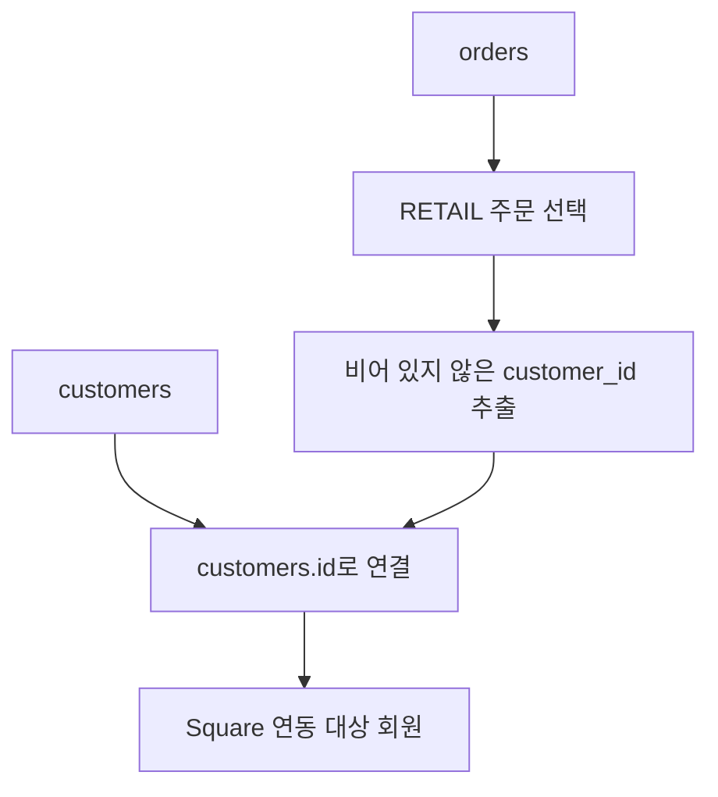

# 🧩 Entity Mapping

Lovable 원본 데이터와 Square 데이터를 어떻게 연결하는지 기록한다.

전체 컬럼을 그대로 옮기기보다, 프로젝트에 필요한 데이터를 선택하고 Square의 구조에 맞게 변환한다.

---

## 📋 1. 엔티티별 진행 상태

| Lovable Entity | Square Resource | 현재 상태 | 연동 범위 |
|---|---|---|---|
| `products` | Catalog | ✅ 1차 완료 | 상품명·설명·SKU·가격 |
| `customers` | Customers | 🟡 진행 중 | RETAIL 주문에 연결된 회원 |
| `customer_addresses` | Customer address | ⚪ 보류 | 고객 주소 연동 필요 시 검토 |
| `stores` | Locations | ⚪ 예정 | 내부 매장 ID와 Square Location ID 연결 |
| `orders` | Orders | ⚪ 예정 | RETAIL 주문만 전송 |
| `order_items` | Order line items | ⚪ 예정 | 선택한 RETAIL 주문의 항목 |
| `payments` | Payments | ⚪ 예정 | 매장 주문의 Sandbox 결제 처리 |
| `loyalty_settings` | 미정 | ⚪ 범위 검토 | 원본 리워드 설정을 그대로 전송한다고 가정하지 않음 |
| `loyalty_transactions` | 미정 | ⚪ 범위 검토 | 원본 리워드 기록과 Square 연동 범위 별도 결정 |
| `tax_settings` | 직접 연동 제외 | — | 주문 금액 처리 시 필요한 세금 정보는 별도 검토 |

> 리워드 기능이 Lovable에서 동작하는 것과
> Square Loyalty에 연동하는 것은 별개의 작업이다.

---

## 🌐 2. 채널별 데이터 경로

### Square 데이터 준비

- 공통 상품은 Square에 등록한다.
- 주문은 `channel = 'RETAIL'`만 선택한다.
- 고객은 해당 매장 주문에 연결된 회원을 선택한다.
- 주문 항목과 결제 데이터도 선택한 매장 주문을 기준으로 가져온다.

### 향후 분석용 수집

| 데이터 | 분석용 수집 경로 |
|---|---|
| 매장 주문 | Square API → GCP → BigQuery |
| 온라인 주문 | Lovable DB → GCP → BigQuery |

Lovable에 남아 있는 RETAIL 원본 주문과 Square 주문은 같은 거래이므로, 분석할 때 중복 합산하지 않는다.

---

## 🍫 3. Product Mapping — 1차 완료

### 구현한 흐름

1. Lovable 상품 데이터를 CSV로 내보낸다.
2. Pandas로 읽고 원본 데이터를 확인한다.
3. SKU로 Square의 기존 상품을 검색한다.
4. 신규 상품을 Square 요청 구조로 변환한다.
5. Square Catalog API로 전송한다.
6. 성공 응답의 Square ID와 sync 정보를 원본 CSV에 저장한다.

### 원본 → Square 필드 매핑

아래 Square 경로는 요청의 `object` 내부를 기준으로 한다.

| Lovable 필드 | Square 필드 | 처리 방법 |
|---|---|---|
| `product_name` | `item_data.name` | 상품명 |
| `description` | `item_data.description` 또는 `description_html` | 변환 코드에서 사용하는 필드에 맞춰 전달 |
| `sku` | `item_data.variations[].item_variation_data.sku` | 상품의 판매 단위 식별 |
| `price` | `item_data.variations[].item_variation_data.price_money.amount` | CAD 달러를 센트 정수로 변환 |
| 원본 값 없음 | `price_money.currency` | `CAD` 설정 |
| `product_id` | 임시 Item / Variation ID 생성에 사용 | 원본 상품과 요청 객체 연결 |

설명 필드는 현재 `transform_product()`에서 실제 사용하는 형태를 기준으로 관리한다.

### 원본에 유지하는 필드

| 필드 | 처리 |
|---|---|
| `id` | Lovable 내부 PK 유지 |
| `is_best_seller` | 원본에서 관리 |
| `active_status` | 원본에서 관리 |
| `created_at`, `updated_at` | 원본 생성·수정 시각 유지 |
| `category` | Square Category 연결은 후속 작업 |
| `image_key` | Square Image 연결은 후속 작업 |

**`active_status`와 `present_at_all_locations`는 같은 의미가 아니다.**

- `active_status`: 원본 시스템의 상품 활성 상태
- `present_at_all_locations`: Square에서 모든 매장에 존재하는지 나타내는 설정

따라서 두 필드를 직접 매핑하지 않는다.

### 변환 과정에서 생성하는 값

| 필드 | 값 |
|---|---|
| Item `type` | `ITEM` |
| Item 임시 `id` | `#<product_id>-item` |
| Variation `type` | `ITEM_VARIATION` |
| Variation 임시 `id` | `#<product_id>-variation` |
| Variation `name` | `Regular` |
| `pricing_type` | `FIXED_PRICING` |
| `currency` | `CAD` |

### 요청 구조 예시

```json
{
  "idempotency_key": "<unique-request-key>",
  "object": {
    "type": "ITEM",
    "id": "#p002-item",
    "present_at_all_locations": true,
    "item_data": {
      "name": "Midnight Dark Chocolate Bar",
      "description": "72% single-origin dark chocolate.",
      "variations": [
        {
          "type": "ITEM_VARIATION",
          "id": "#p002-variation",
          "item_variation_data": {
            "name": "Regular",
            "sku": "CCF-BAR-002",
            "pricing_type": "FIXED_PRICING",
            "price_money": {
              "amount": 725,
              "currency": "CAD"
            }
          }
        }
      ]
    }
  }
}
```

### Item ID와 Variation ID

| ID | 의미 | 활용 |
|---|---|---|
| Item ID | 상품 객체 ID | 상품 조회·삭제 등 |
| Item Variation ID | SKU·가격이 연결된 판매 단위 ID | 주문 항목에 상품 연결 |

현재 공유한 코드에서는 다음 값을 저장한다.

```python
square_catalog_object_id = square_variation["id"]
```

즉, 현재 `square_catalog_object_id`에는 **Variation ID**가 들어간다.

Item ID로 착각해서 사용하지 않도록 주의한다. 향후 컬럼을 분리한다면 기존 데이터와 참조 코드도 함께 변경해야 한다.

---

## 💾 4. 상품 연동 결과 저장

별도의 `product_square_mapping.csv` 대신,
입력 파일인 `products_export.csv`의 해당 상품 행을 업데이트하는 방식으로 변경했다.

| 컬럼 | 저장 내용 |
|---|---|
| `square_catalog_object_id` | 현재 코드 기준 Square Variation ID |
| `square_sync_status` | 성공 시 `SUCCESS` |
| `square_synced_at` | 성공 시각, UTC |
| `square_sync_error` | 현재 실패 기록은 구현하지 않음 |

### 현재 처리 기준

- SKU가 정확히 한 행에 해당하는지 확인한다.
- 상품 데이터는 유지하고 sync 관련 컬럼만 수정한다.
- 성공한 결과만 저장한다.
- API 실패는 콘솔에서 확인한다.
- 상품 생성 후 CSV 저장이 실패하면 기존 삭제 함수로 방금 생성한 상품 삭제를 시도한다.

로컬 CSV를 수정해도 Lovable DB에는 자동 반영되지 않는다.

### 남아 있는 개선 사항

현재 기존 SKU는 건너뛰므로, 새로 export한 CSV에는 기존 Square ID가 채워지지 않을 수 있다.

기존 상품도 정확한 SKU로 조회한 뒤 ID를 원본 CSV에 기록하는 처리는 추가 구현이 필요하다.

상품 가격·설명 변경을 Square에 반영하는 업데이트 기능도 별도 작업이다.

---

## 👤 5. Customer Mapping — 진행 중

### 확인한 원본 구조

현재 `customers_export.csv`는 회원 22명, 컬럼 15개이며 구분자는 `;`이다.

```text
id
customer_number
user_id
email
first_name
last_name
phone
customer_type
square_customer_id
created_at
updated_at
signup_channel
square_sync_status
square_synced_at
square_sync_error
```

### 고객 ID 구분

| 컬럼 | 의미 |
|---|---|
| `id` | 원본 고객 PK, 주문과 연결 |
| `customer_number` | 사람이 확인하기 위한 회원 번호 |
| `user_id` | 로그인 계정과 연결하는 ID |
| `square_customer_id` | Square 고객 생성 후 반환되는 ID |

확인된 주문·고객 연결 관계:

```text
orders.customer_id = customers.id
```

### 연동 대상 선택

1. 주문에서 `channel = 'RETAIL'`만 선택한다.
2. 고객 ID가 없는 비회원 주문은 고객 생성 대상에서 제외한다.
3. 중복 없이 고객 ID를 추린다.
4. `customers.id`와 연결해 대상 회원을 선택한다.
5. 주문에 있는 고객 ID가 고객 CSV에 없으면 확인 후 진행한다.

**`signup_channel`로 연동 대상을 선택하지 않는다.**

온라인에서 가입한 회원도 매장 주문이 있으면 Square 연동 대상이다.



### 고객 필드 매핑 초안

아래는 고객 생성 구현 전에 확정할 매핑 초안이다.

| 원본 필드 | Square 대상 필드 | 계획 |
|---|---|---|
| `id` | `reference_id` | 원본 고객 ID를 참조값으로 전달 |
| `first_name` | `given_name` | 이름 |
| `last_name` | `family_name` | 성 |
| `email` | `email_address` | 이메일 |
| `phone` | `phone_number` | 전화번호 형식 확인 후 전달 |
| `customer_number` | 직접 전송하지 않음 | 원본에 유지 |
| `user_id` | 직접 전송하지 않음 | 원본 로그인 연결 정보 |
| `customer_type` | 직접 전송하지 않음 | 원본에 유지 |
| `signup_channel` | 직접 전송하지 않음 | 가입 경로로 유지 |
| `created_at`, `updated_at` | 직접 전송하지 않음 | 원본 시각 유지 |

주소는 별도 테이블이므로 이번 기본 고객 연동 이후 필요에 따라 추가한다.

### 고객 성공 결과 저장 — 구현 예정

| CSV 컬럼 | 저장할 값 |
|---|---|
| `square_customer_id` | Square 응답의 고객 ID |
| `square_sync_status` | `SUCCESS` |
| `square_synced_at` | 성공 시각, UTC |
| `square_sync_error` | 현재 성공 결과 저장 범위에서는 비워둠 |

회원 결과는 `customers.id`로 해당 행을 찾아 업데이트한다.

**전송 대상만 CSV에 저장하지 않는다.**
전체 고객 CSV를 유지하면서 대상 회원의 sync 컬럼만 수정해야 온라인 전용 회원이 파일에서 사라지지 않는다.

---

## 🏪 6. Store / Order Mapping — 예정

| 원본 값 | 연결 대상 |
|---|---|
| 내부 `store_id` | Square Location ID |
| 주문의 `customer_id` | 해당 고객의 Square Customer ID |
| 주문 항목의 상품 참조 | 해당 상품의 Square Item Variation ID |
| 원본 주문 ID | 생성된 Square Order ID |

원본 주문 항목이 상품의 어떤 키를 참조하는지는 실제 CSV 구조를 확인한 후 확정한다.

주문을 전송하기 전에 상품·고객·매장의 연결 정보를 준비해야 한다.

비회원 주문은 고객 연결 없이 유지한다.

---

## 📁 7. 코드 역할

| 경로 | 역할 |
|---|---|
| `src/extract/` | CSV 읽기 및 원본 검증 |
| `src/transform/products.py` | 상품 요청 데이터 변환 |
| `src/square/catalog.py` | 상품 검색·생성·삭제 API, 현재 상품 결과 저장 함수 |
| `src/pipelines/products_pipeline.py` | 상품 처리 흐름 관리 |
| `src/transform/customers.py` | 고객 요청 데이터 변환 예정 |
| `src/square/customers.py` | 고객 API 호출 예정 |
| `src/pipelines/customers_pipeline.py` | 매장 주문 기준 고객 선택 및 연동 흐름 구성 |

---

## 🧠 8. Mapping을 통해 이해한 점

- 원본과 대상 시스템의 구조는 1:1일 필요가 없다.
- 하나의 상품 행이 Item과 Variation을 포함한 중첩 구조로 변환될 수 있다.
- 원본에 없는 필수 값은 변환 과정에서 생성한다.
- 원본 ID, 로그인 ID, 외부 시스템 ID는 역할이 다르다.
- 매장 주문 연동 대상은 가입 경로가 아닌 실제 주문 채널로 판단한다.
- 중복 생성 방지와 기존 ID 매핑 복구는 별개의 작업이다.
- 로컬 CSV 저장과 원본 DB 업데이트는 별개의 작업이다.

> Mapping은 컬럼 이름을 바꾸는 작업뿐 아니라,
> 데이터의 의미·구조·식별 관계를 대상 시스템에 맞게 연결하는 과정이다.