# Entity Mapping

## Lovable → Square

| Lovable Entity | Square Resource | Status |
|---|---|---|
| products | Catalog | 🟡 In Progress |
| customers | Customers | ⚪ Not Started |
| customer_addresses | Customers | ⚪ Not Started |
| stores | Locations | ⚪ Not Started |
| orders | Orders | ⚪ Not Started |
| order_items | Order Line Items | ⚪ Not Started |
| payments | Payments | ⚪ Not Started |
| loyalty_settings | Loyalty | ⚪ Not Started |
| loyalty_transactions | Loyalty | ⚪ Not Started |
| tax_settings | Catalog Tax | ⚪ Not Started |


## 🔄 Product Data Integration Flow

This process transforms product data exported from the Lovable database into the format required by the Square Catalog API.

```mermaid
flowchart LR
    A["📄 Lovable CSV"] --> B["🐼 Pandas DataFrame"]
    B --> C["🔍 Data Inspection"]
    C --> D["🧩 Field Mapping"]
    D --> E["🧹 Data Transformation"]
    E --> F["📦 JSON Payload"]
    F --> G["🔗 Square Catalog API"]
    G --> H["✅ Response Validation"]
    H --> I["💾 Square ID Mapping"]
```



### 📋 Process Overview

| Step | Process | Description |
|---:|---|---|
| 1 | 📄 **Export** | Export product data from the Lovable database as a CSV file. |
| 2 | 🐼 **Load** | Load the CSV file into a Pandas DataFrame. |
| 3 | 🔍 **Inspect** | Review the source schema, data types, missing values, duplicates, and overall data quality. |
| 4 | 📖 **Review API Schema** | Review the relevant Square API object specifications, including `CatalogObject`, `CatalogItem`, `CatalogItemVariation`, and `Money`. |
| 5 | 🧩 **Map Fields** | Define mapping rules between the Lovable source fields and Square target fields. |
| 6 | 🧹 **Transform** | Clean and transform the source values according to Square’s requirements. |
| 7 | 📦 **Build Payload** | Construct a valid JSON request payload. |
| 8 | 🔗 **Send Request** | Send the payload to the Square Catalog API. |
| 9 | ✅ **Validate Response** | Check whether the request succeeded and review any returned errors. |
| 10 | 💾 **Store IDs** | Store the Square-generated object IDs for future updates and synchronization. |

---

### 🧩 Example Field Mapping

| Lovable Source Field | Square Target Field | Transformation Rule |
|---|---|---|
| `name` | `item_data.name` | Convert to a non-empty string |
| `description` | `item_data.description` | Replace missing values with an empty string |
| `sku` | `item_variation_data.sku` | Convert to a string and check for duplicates |
| `price` | `price_money.amount` | Convert Canadian dollars to cents |
| — | `price_money.currency` | Set a default value of `CAD` |
| `is_active` | `present_at_all_locations` | Convert to a Boolean value |

#### Price Transformation Example

```text
12.50 CAD → 1250
```

Square stores monetary values using the smallest currency unit. Therefore, Canadian dollar values must be converted to cents before they are sent to the API.

---

### 🔑 Object ID Mapping

After Square successfully creates a catalog object, it returns a permanent Square object ID.

The source ID and Square ID should both be stored so that the same object can be updated or synchronized later.

| Entity Type | Lovable Source ID | Square Object ID | Sync Status |
|---|---|---|---|
| Product | `prod_001` | `SQUARE_ITEM_ID` | `SUCCESS` |
| Variation | `prod_001_regular` | `SQUARE_VARIATION_ID` | `SUCCESS` |

> 💡 Preserving the ID mapping helps prevent duplicate records and enables future update and synchronization operations.

---

### ✨ Summary

> Product data is exported from the Lovable database, loaded into a Pandas DataFrame, inspected for data quality, and mapped to the Square Catalog API schema. The data is then cleaned, transformed into a valid JSON request payload, and sent to the Square Catalog API. Finally, the API response is validated, and the Square-generated object IDs are stored for future updates and synchronization.