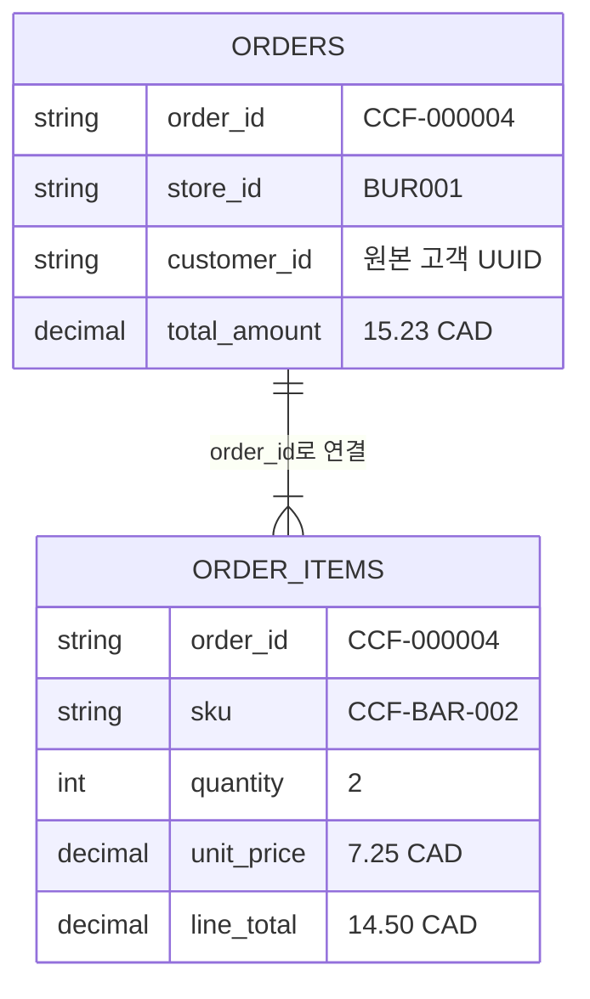
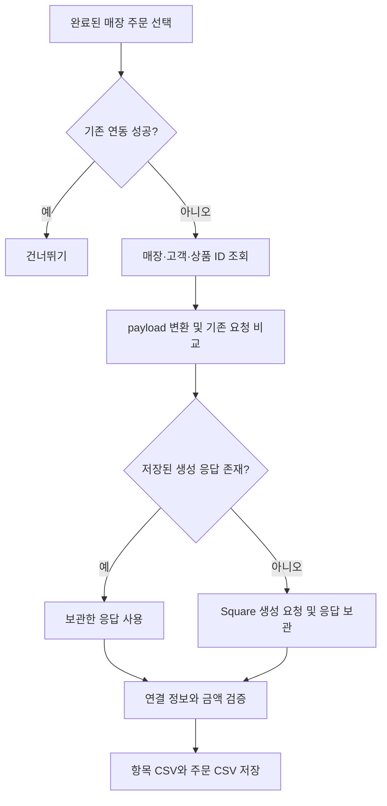

# Learning Notes

This file documents what I learned while building the project
이 프로젝트를 진행하며 내가 직접 이해한 내용을 내언어로 정리합니다.

# 🍫 Why I Became Interested in Purdys

## 🇨🇦 How I Became Interested in Purdys

캐나다에 와서 흥미롭게 느낀 것 중 하나는 **특별한 날에 초콜릿을 주고받는 문화**와 **초콜릿을 전문적으로 판매하는 브랜드 매장**을 일상에서 쉽게 볼 수 있다는 점이었습니다.

한국에서도 많은 사람들이 초콜릿을 좋아하지만, 제가 한국에서 오랫동안 생활하면서 **Purdys와 같은 초콜릿 전문 브랜드를 일상에서 자주 접하지는 못했습니다.**

한국에서는 보통 여러 제과회사에서 만든 초콜릿이나 해외 브랜드 제품을 **대형마트와 편의점에서 구매하는 방식**이 더 익숙했습니다.

### 🇰🇷 Korea vs. 🇨🇦 Canada

| 🇰🇷 Korea | 🇨🇦 Canada |
|---|---|
| 🏪 편의점·마트 중심 | 🍫 초콜릿 전문 브랜드 매장 |
| 🍬 대형 제과회사 제품 | 🎁 브랜드별 초콜릿 컬렉션 |
| 💝 일부 특별한 날 선물 | 🎄 다양한 시즌·기념일 선물 |
| 🌍 해외 브랜드 비중이 높음 | 🇨🇦 로컬 초콜릿 브랜드 존재 |

캐나다에 처음 왔을 때는 이렇게 **초콜릿만 전문적으로 판매하는 브랜드 매장이 여러 지역과 쇼핑몰에 있다는 사실**이 꽤 신기했습니다.

마침 집 근처에 **Purdys 매장**이 있었기 때문에 자연스럽게 브랜드에 관심을 가지게 되었고,

> **"왜 캐나다에서는 이런 초콜릿 전문 브랜드가 이렇게 익숙할까?"**

라는 궁금증에서 Purdys와 캐나다의 초콜릿 시장을 조금씩 찾아보기 시작했습니다.

---

# 🔎 Researching Purdys' Business Direction

Purdys에 관심을 가지게 된 후에는 단순히 초콜릿 브랜드 자체보다 **회사가 최근 어떤 방향으로 비즈니스와 기술 환경을 발전시키고 있는지**가 궁금해졌습니다.

## 🏪 80+ Stores → ▣ Square

Purdys는 **2025년 Square를 새로운 기술 파트너로 선정**하고, 캐나다 전역의 80개 이상의 매장에 Square의 POS 및 운영 시스템을 도입했습니다.

처음에는 단순히

> `기존 POS → ▣ Square POS`

로 변경하는 프로젝트라고 생각했습니다.

하지만 조금 더 조사하면서 이 변화가 단순한 결제 시스템 교체 이상의 의미를 가질 수 있다고 생각했습니다.

---

## 🔗 Connecting Retail Data

제가 이해한 구조를 간단하게 표현하면 다음과 같습니다.

```text
                🍫 Purdys Retail Ecosystem

                   🏪 Physical Stores
                           │
                           ▼
                    ┌─────────────┐
                    │  ▣ Square   │
                    │ POS / Data  │
                    └──────┬──────┘
                           │
                           ▼
                  ☁️ Unified Data Platform
                           │
                  ┌────────┼────────┐
                  ▼        ▼        ▼
                 📦       👤       📊
             Inventory  Customer  Analytics
```

각 매장에서 발생하는 데이터를 하나의 환경에서 연결할 수 있다면 단순한 매출 집계를 넘어 훨씬 다양한 분석이 가능해집니다.

### 📊 What Could Be Analyzed?

| Data | Possible Analysis |
|---|---|
| 🏪 **Store Sales** | 매장별 매출 및 상품 판매량 |
| 🛒 **Online Sales** | 온라인과 오프라인 판매 비교 |
| 🍫 **Product** | 채널·지역별 인기 상품 |
| 👤 **Customer** | 고객 구매 패턴 및 재구매 행동 |
| 📦 **Inventory** | 매장별 재고 및 품절 패턴 |
| 🎁 **Gift Cards** | 채널 간 기프트카드 사용 |
| 🏷️ **Promotions** | 프로모션 성과 |
| 📅 **Seasonality** | 시즌별 수요 변화 |

---

# 🎄 Chocolate Is a Highly Seasonal Business

초콜릿 비즈니스에서 특히 흥미로운 부분은 **Seasonality**라고 생각했습니다.

```text
💕 Valentine's Day
        │
        ▼
🐰 Easter
        │
        ▼
💐 Mother's Day
        │
        ▼
🎃 Halloween
        │
        ▼
🎄 Christmas
        │
        ▼
   🍫 Demand Changes
        │
        ▼
 📊 Sales Forecasting
        │
        ▼
 📦 Inventory Planning
```

초콜릿은 특정 기념일과 시즌에 따라 수요가 크게 달라질 수 있습니다.

따라서 지역과 시즌에 따른 판매 패턴을 분석한다면,

> **어떤 매장에 → 어떤 상품을 → 얼마나 준비해야 하는지**

예측하고 재고를 계획하는 데에도 데이터를 활용할 수 있다고 생각했습니다.

---

# 🌐 From Retail to Omnichannel

이러한 내용을 조사하면서 제가 가장 흥미롭게 느낀 부분은 **Omnichannel Retail**이었습니다.

제가 이해한 Purdys의 비즈니스 구조를 단순화하면 다음과 같습니다.

```text
                       👤 Customer
                            │
               ┌────────────┼────────────┐
               ▼            ▼            ▼
            🏪 Store     🛒 Online     📦 Other
              POS           Store       Channels
               │            │            │
               └────────────┼────────────┘
                            ▼
                    ☁️ Data Platform
                            │
                ┌───────────┼───────────┐
                ▼           ▼           ▼
             📊 Sales    📦 Inventory  👤 Customer
             Analysis      Planning      Insights
                └───────────┼───────────┘
                            ▼
                    💡 Better Decisions
```

즉,

### 🏪 Offline + 🛒 Online + 📦 Other Channels → ☁️ Connected Data

온라인몰을 별도로 운영하는 것이 아니라 **오프라인 매장, 온라인몰, 그리고 다양한 판매 채널에서 발생하는 데이터를 연결하여 하나의 리테일 환경으로 바라보는 것**입니다.

이렇게 연결된 데이터는 매출 분석뿐만 아니라 고객 행동 분석, 재고 관리, 프로모션 분석, 시즌별 수요 예측 등 다양한 비즈니스 의사결정에 활용될 수 있습니다.

---

# 💡 This Led to My Project Idea

Purdys의 비즈니스와 기술 환경을 조사하면서 한 가지 질문이 생겼습니다.

> **"여러 매장과 온라인몰에서 발생하는 데이터를 실제로 하나의 데이터 플랫폼으로 연결한다면 어떻게 설계할 수 있을까?"**

그래서 실제 Purdys의 시스템이나 데이터를 사용하는 대신, 가상의 초콜릿 브랜드인 **Charlie's Chocolate Factory 🍫**를 만들어 비슷한 비즈니스 환경을 직접 구성해보기로 했습니다.

---

## 🍫 Charlie's Chocolate Factory

Purdys를 조사하면서 이해한 리테일 비즈니스 구조를 직접 실험해보기 위해 만든 **가상의 초콜릿 판매 플랫폼**입니다.

Lovable을 활용하여 온라인 쇼핑몰과 오프라인 매장을 가진 가상의 초콜릿 브랜드 환경을 만들었습니다.

### 🌐 Live Demo

> ### 🍫 [Charlie's Chocolate Factory 방문하기 →](https://chocoflavor.dev/)
>
> **온라인스토어/POS 를 직접 둘러보고 가상의 초콜릿 리테일 환경을 확인할 수 있습니다.**

현재 프로젝트에서는 다음과 같은 비즈니스 환경을 가정하고 있습니다.

| Channel | 역할 |
|---|---|
| 🏪 **Physical Stores** | Vancouver, Burnaby, Richmond 매장 |
| ▣ **Square POS** | 오프라인 매장의 상품 및 거래 데이터 |
| 🛒 **Online Store** | 고객 온라인 주문 |
| 👤 **Customer** | 회원 및 구매 데이터 |
| 🎁 **Rewards** | 구매 금액 기반 리워드 |
| 📦 **Products** | 온라인·오프라인에서 판매되는 상품 |

이 웹사이트 자체를 만드는 것이 프로젝트의 최종 목적은 아닙니다.

**실제 리테일 비즈니스와 비슷한 데이터가 발생하는 환경을 만들고, 그 데이터를 Data Engineering 관점에서 수집하고 연결하는 것**이 이 프로젝트의 핵심 목표입니다.

---

# 🏗️ From Chocolate Store to Data Platform

제가 만들고 싶은 전체 구조는 다음과 같습니다. (Online store/ POS 두가지버전 구현)

```text
 🏪 Physical Stores                         🛒 Online Store
         │                                         │
         │ Transactions                            │ Orders
         ▼                                         ▼
   ┌───────────────┐                           ┌───────────────┐
   │ ▣ Square API │                           │ E-commerce DB │
   └──────┬────────┘                           └─────┬─────────┘
          │                                          │
          └────────────────────┬─────────────────────┘
                               ▼
                        ⚙️ Data Pipeline
                               │
                               ▼
                        ☁️ Data Platform
                               │
                    ┌──────────┼──────────┐
                    ▼          ▼          ▼
                   📊         📦         👤
                 Sales     Inventory   Customer
                Analysis    Analysis   Analysis
```

### 🔗 Business Flow

```text
🍫 Charlie's Chocolate Factory
             │
      ┌──────┴──────┐
      ▼             ▼
 🏪 Offline       🛒 Online
    Stores           Store
      │               │
      ▼               ▼
 ▣ Square API    E-commerce DB
      │               │
      └───────┬───────┘
              ▼
        ⚙️ Data Engineering
              ▼
        ☁️ Data Platform
              ▼
        📊 Business Insights
```
# ⚙️ From Lovable DB to Square

가상의 초콜릿 판매 환경을 만든 후, 다음 단계로 **Lovable DB에 저장된 상품 데이터를 Square로 가져오는 작업**을 진행했습니다.

처음부터 Square에 상품을 직접 입력하는 대신, 기존 Lovable DB의 데이터를 활용하여 **데이터를 추출하고, 변환하고, Square API를 통해 전송하는 과정**을 직접 구현해보기로 했습니다.

## 1️⃣ Export Data from Lovable DB

먼저 Lovable DB에 저장되어 있던 상품 데이터를 `.csv` 파일로 Export했습니다.

```text
🍫 Lovable DB
      │
      ▼
📄 CSV Export
(; delimiter)
```


---

## 2️⃣ Read & Inspect Data with Pandas

다음으로 Python의 **Pandas**를 사용하여 CSV 파일을 읽었습니다.

이 단계에서는 단순히 데이터를 불러오는 것뿐만 아니라,

- 어떤 column들이 존재하는지
- 데이터 타입은 무엇인지
- 값이 정상적으로 들어왔는지
- Square에서 사용할 수 있도록 어떤 데이터를 변환해야 하는지

확인했습니다.

```text
📄 CSV
   │
   ▼
🐼 Pandas
   │
   ▼
🔍 Inspect Data
   │
   ├── Columns
   ├── Data Types
   └── Values
```

---

## 3️⃣ Transform Data for Square API

Lovable DB의 데이터 구조와 Square API가 요구하는 데이터 구조는 서로 다르기 때문에, 데이터를 그대로 전송할 수는 없었습니다.

따라서 Python/Pandas를 사용하여 **Lovable의 데이터 구조를 Square API가 이해할 수 있는 형태로 변환하고 mapping하는 과정**을 진행했습니다.

```text
🍫 Lovable Data
       │
       ▼
   🐼 Pandas
       │
       ▼
⚙️ Clean / Transform / Map
       │
       ▼
   📦 Square API Format
       │
       ▼
    ▣ Square
```

개념적으로는 다음과 같은 **Source → Target Mapping** 과정입니다.

| Source: Lovable | Target: Square |
|---|---|
| Product Name | Item Name |
| Description | Description |
| Price | Money / Amount |
| Category | Category Mapping — 후속 작업 |

이 과정을 통해 기존 시스템의 데이터를 새로운 시스템에서 사용할 수 있도록 변환하는 **Data Transformation과 Schema Mapping**의 기본 개념을 직접 경험할 수 있었습니다.

---

## 4️⃣ Send Data through Square API

변환된 데이터는 Square API가 받을 수 있는 request 형태로 구성한 후 API를 통해 Square로 전송했습니다.

전체 흐름을 정리하면 다음과 같습니다.

```text
🍫 Lovable DB
      │
      ▼
📄 CSV Export
      │
      ▼
🐼 Pandas
      │
      ▼
🔍 Data Inspection
      │
      ▼
⚙️ Transformation & Mapping
      │
      ▼
📦 API Request
      │
      ▼
▣ Square API
      │
      ▼
✅ Square Catalog
```

---

## 💻 Implementation

Learning Notes에는 전체 코드 대신 **무엇을 했고 왜 그렇게 했는지**를 중심으로 기록했습니다.

실제 Python 구현은 아래 소스 코드에서 확인할 수 있습니다.

| 역할 | 소스 코드 |
|---|---|
| CSV 읽기 | [load_csv.py](./src/extract/load_csv.py) |
| 상품 변환 | [products.py](./src/transform/products.py) |
| 상품 API 연동 | [catalog.py](./src/square/catalog.py) |
| 고객 API 연동 | [customers.py](./src/square/customers.py) |
| 매장 API 연동 | [location.py](./src/square/location.py) |
| 주문 변환 | [orders.py](./src/transform/orders.py) |
| 주문 API 연동 | [orders.py](./src/square/orders.py) |
| 주문 단건 테스트 | [test_orders.py](./tests/test_orders.py) |
| 주문 일괄 처리 | [order_pipeline.py](./src/pipelines/order_pipeline.py) |

CSV 읽기, 데이터 변환, API 호출을 역할별로 나누고, pipeline에서 전체 흐름을 실행하도록 구성했습니다.

---

## 5️⃣ Extend Mapping to Customers & Stores

상품 다음으로 고객과 매장 데이터를 Square에 연결했습니다.

| 원본 데이터 | Square 연결 대상 | 진행 내용 |
|---|---|---|
| products | Catalog Item / Variation | 상품 생성 및 연동 결과 저장, 전체 상품 생성 테스트 |
| customers | Customer | POS 가입 고객의 기본 생성 및 고객 ID 저장 |
| customer_addresses | Customer 연결 정보 | 주소 CSV에 Square 고객 ID 기록, 실제 주소 전송과 구분 |
| stores | Location | 매장 생성 테스트, 원본 DB와 CSV에 우편번호 반영 완료 |

고객은 `signup_channel = 'POS'`를 기준으로 선택하고, 원본 고객 `id`를 Square의 `reference_id`와 연결했습니다.
가입 경로와 주문 발생 경로는 다르기 때문에, 온라인 가입 고객의 매장 주문도 이후 고객 연결 여부를 확인해야 합니다.

매장 생성 과정에서는 주소의 `postal_code`가 빠져 있어 **Lovable의 기존 DB를 수정하고, CSV에도 우편번호가 포함되도록 반영**했습니다.
주문을 생성할 때는 이 매장의 Square Location ID를 찾아 사용합니다.

---

## 6️⃣ Connect Retail Orders to Square

주문은 상품 한 건을 변환하는 것보다 여러 데이터를 함께 확인해야 했습니다.
**어느 매장에서, 어떤 고객이, 어떤 상품을 몇 개 구매했는지**를 하나의 요청으로 묶는 작업이기 때문입니다.

### 🏪 이번 Square 연동 범위

프로젝트에서는 주문이 크게 두 경로에서 발생한다고 가정했습니다.

| 주문 경로 | 이번 처리 | 향후 분석용 수집 |
|---|---|---|
| 매장 주문: RETAIL | Square Sandbox에 가상 매장 거래 준비 | Square API |
| 온라인 주문: ONLINE | 이번 Square 전송에서 제외 | Lovable DB |

현재 Lovable은 온라인몰과 가상 POS 역할을 모두 합니다.
Lovable → Square 전송은 매장 데이터 소스를 준비하는 과정이고, 이후에는 **Square의 매장 데이터와 Lovable의 온라인 데이터를 각각 수집해 통합**할 계획입니다.
Lovable에 남아 있는 RETAIL 주문까지 다시 합치면 같은 거래가 중복 집계되므로 구분해야 합니다.

### 🔑 주문과 주문 항목 연결

첫 테스트 대상으로 `CCF-000004`를 선택했습니다.

```python
order_df = orders_df.loc[
    (orders_df["channel"] == "RETAIL")
    & (orders_df["order_status"] == "COMPLETED")
    & (orders_df["order_id"] == "CCF-000004")
].copy()
```

이번 CSV에서는 **`order_items.order_id`와 `orders.order_id`가 연결**됩니다.
`orders.id`인 UUID와 연결하는 것이 아니라 `CCF-000004` 같은 주문 번호를 사용합니다.



그림은 CSV에서 확인한 논리적 관계이며 실제 DB 제약을 표시한 것은 아닙니다.
같은 상품 2개를 구매했으므로 이번 예시의 주문 항목은 1행이고, `quantity`는 2입니다.

### 🔗 기존 Square ID를 찾아 payload에 연결

주문 CSV의 Square 컬럼은 처음에는 비어 있습니다.
기존에 연동 결과를 저장한 매장·고객·상품 CSV에서 ID를 찾아 요청에 넣도록 작성했습니다.

| 원본 연결 기준 | 조회할 데이터 | Square 요청 필드 |
|---|---|---|
| 주문의 store_id | 매장 CSV의 square_location_id | order.location_id |
| 주문의 customer_id = 고객 CSV의 id | 고객 CSV의 square_customer_id | order.customer_id |
| 주문 항목의 sku | 상품 CSV의 square_catalog_object_id — Variation ID | order.line_items[].catalog_object_id |
| 주문의 order_id | 원본 주문 번호 | order.reference_id |
| 주문 항목의 id | 원본 항목 UUID | order.line_items[].uid |

상품 한 개의 주문 당시 가격 `7.25 CAD`는 `725`센트로 변환하고, 수량은 문자열 `"2"`로 전달합니다.
세율은 원본의 `0.0500`을 `"5"`로 변환합니다.
주문과 항목은 `order`와 그 안의 `line_items`로 묶어 한 번의 생성 요청으로 보냅니다.

### ✅ 생성·검증·저장은 구분한다

주문 변환 함수는 payload를 만들고, API 함수는 Square에 전송한 뒤 응답의 `order` 객체를 반환하도록 작성했습니다.
그다음 응답의 세금·총액을 원본과 비교하고, 검증에 성공하면 주문·항목 CSV에 Square 연결 정보를 저장합니다.

원본 예시 총액은 `14.50 + 0.73 = 15.23 CAD`입니다.
Square에서도 반드시 같은 금액이 나온다고 가정하지 않고, 실제 계산 결과를 비교합니다.

| 상태 | 의미 |
|---|---|
| 원본 order_status = COMPLETED | Lovable 원본 거래 상태 |
| Square state = OPEN | 이번 생성 요청에서 지정한 Square 주문 상태 |
| square_sync_status = SUCCESS | 주문 생성·금액 검증·CSV 저장 성공 |

**주문 생성과 결제 완료는 별개**이므로, 원본의 `COMPLETED`를 Square에 그대로 복사하지 않습니다.

---

## 7️⃣ Expand to an Order Pipeline

단건 테스트 코드 작성 후, 같은 흐름을 여러 주문에 반복 적용하는 `order_pipeline.py`를 작성했습니다.

첨부 CSV 기준 전체 주문은 36건이며, 매장 주문 22건 중 완료된 주문은 19건입니다.
현재 파이프라인은 **RETAIL이면서 COMPLETED인 주문**을 대상으로 하며, 할인·배송비가 없는 주문을 처리합니다.
취소·환불 주문은 별도 흐름으로 확장할 예정입니다.



- 이미 `SUCCESS`이고 Square 주문 ID가 있으면 건너뜁니다.
- 같은 요청을 다시 실행할 때 같은 멱등성 키와 요청 내용을 유지합니다.
- 저장된 요청 내용과 새 payload가 다르면 중단합니다.
- 생성 응답이 남아 있으면 재생성 대신 검증과 저장을 다시 진행합니다.
- 오류가 발생하면 해당 주문에서 중단하고 원인을 확인합니다.
- CSV는 임시 파일에 쓴 후 교체하며, 실패한 행을 `FAILED`로 별도 저장하는 기능은 아직 넣지 않았습니다.

두 CSV 저장은 하나의 트랜잭션이 아니므로 항목 CSV만 저장되는 부분 성공이 생길 수 있습니다.
이때 이미 생성한 Square 주문을 다시 만들지 않고, 보관한 응답을 사용해 저장을 복구하도록 구성했습니다.
로컬 CSV 수정은 Lovable DB에 자동 반영되지 않습니다.

> 현재 주문 부분은 **변환·API 호출·검증·저장·일괄 처리 코드 작성까지** 기록한 상태입니다.
> 실제 API 실행 결과와 전체 대상의 성공 건수는 실행 확인 후 추가합니다.

---

## 🧠 What I Learned

이번 작업을 통해 단순히 API를 호출하는 것뿐만 아니라,

**Source Data → Inspection → Transformation → Schema Mapping → API → Target System**

으로 데이터가 이동하는 전체 과정을 이해할 수 있었습니다.

```text
Raw Data
   ↓
Understand the Data
   ↓
Transform the Data
   ↓
Match the Target Schema
   ↓
Send through API
   ↓
Validate the Result
```

이 과정은 앞으로 더 큰 Data Pipeline을 설계하기 위한 기초 단계라고 생각합니다.

주문 작업을 진행하면서는 다음 내용을 추가로 이해했습니다.

- 원본 ID와 Square ID는 다르며, 기존 매핑을 조회해 연결해야 합니다.
- 주문 전체와 주문 항목은 서로 다른 단위의 데이터입니다.
- API 생성 성공, 금액 검증 성공, 로컬 저장 성공을 구분해야 합니다.
- 같은 요청의 재시도와 새로운 주문 생성은 다릅니다.
- 과거 주문을 재현하면 원본 거래 시각과 Square 생성 시각이 다르므로, 분석용 원본 거래 시각을 보존해야 합니다.

### ☁️ Next: Collect and Integrate the Two Sources

주문·결제 연동을 준비한 뒤에는 Data Engineering Zoomcamp 학습 내용을 적용해 프로젝트를 이어갈 계획입니다.

1. Square 매장 데이터와 Lovable 온라인 데이터를 각각 수집합니다.
2. GCP·BigQuery에 적재하고 공통 주문·상품·고객 구조로 정제합니다.
3. dbt 모델링과 데이터 검증을 적용합니다.
4. 하루 한 번 실행하는 배치 파이프라인으로 자동화합니다.
5. 채널별 매출·인기 상품·매장별 판매를 비교합니다.

결제, 취소·환불 처리와 GCP 적재는 아직 완료한 작업에 포함하지 않습니다.

---

## 🎯 Project Goal

> **Build a simplified omnichannel commerce data platform that integrates physical store and online transaction data.**

이 프로젝트를 통해 단순히 여러 기술을 사용하는 것보다,

### Why → How → Business Value

```text
❓ Why collect the data?
          ↓
🔗 How can different data sources be connected?
          ↓
⚙️ How should the data pipeline be designed?
          ↓
☁️ How should the data be stored and transformed?
          ↓
📊 How can the data support business decisions?
```

이 전체 흐름을 직접 이해하는 것을 목표로 하고 있습니다.

---

# 🚀 My Learning Journey

이 프로젝트가 시작된 과정을 정리하면 다음과 같습니다.

```text
🍫 Curiosity about Canadian chocolate culture
                    │
                    ▼
           🏪 Discovered Purdys
                    │
                    ▼
     🔎 Researched its business direction
                    │
                    ▼
       ▣ Learned about Square integration
                    │
                    ▼
 🌐 Became interested in omnichannel retail data
                    │
                    ▼
 🍫 Built Charlie's Chocolate Factory
                    │
                    ▼
 ⚙️ Building an omnichannel data platform
                    │
                    ▼
 📊 Learning Data Engineering through
          a real business scenario
```

### 🍫 Curiosity → 🔎 Research → 💡 Idea → 🛒 Business Simulation → ⚙️ Engineering → 📊 Data

이 프로젝트는 단순히 기술을 연습하기 위한 프로젝트라기보다, **실제 비즈니스에 대한 궁금증에서 시작하여 가상의 리테일 환경을 만들고, 그 환경에서 발생하는 데이터를 활용해 Data Engineering을 공부하는 Learning Project**입니다.

---

## 🔗 Project Links

🍫 **Live E-commerce Demo**  
[Charlie's Chocolate Factory →](https://chocoflavor.dev/)

🏪 **POS Demo**  
[매장 POS →](https://chocoflavor.dev/pos)

💻 **Data Engineering Repository**  
현재 보고 있는 GitHub Repository

📝 **Learning Notes**  
이 프로젝트를 진행하면서 이해한 내용과 기술적인 의사결정을 지속적으로 기록합니다.